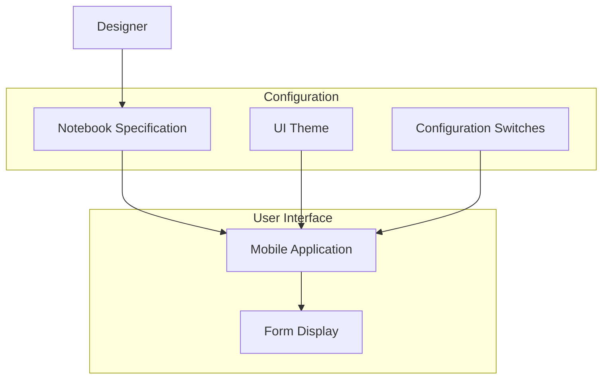
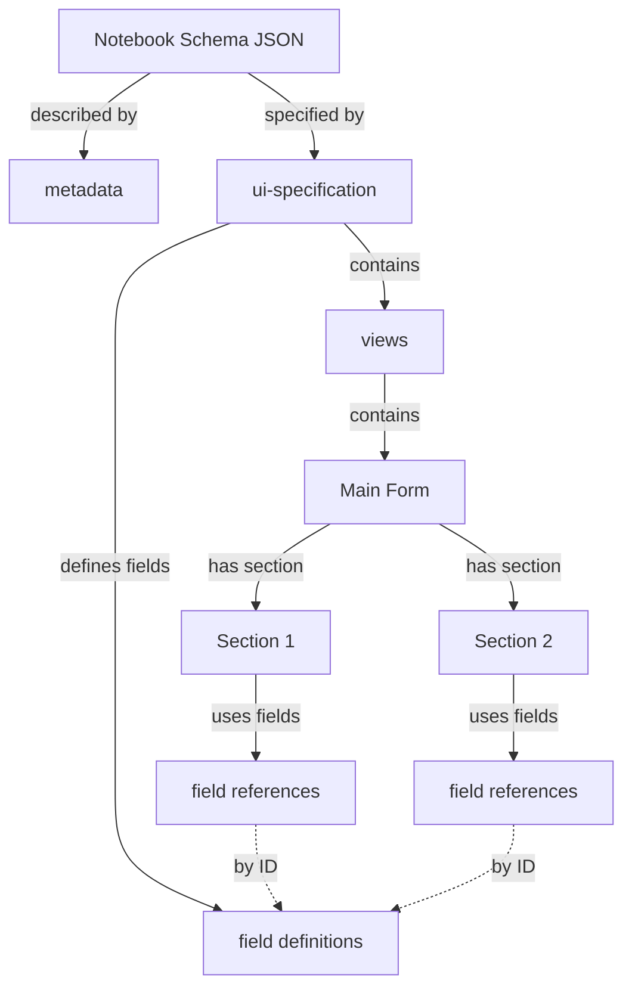
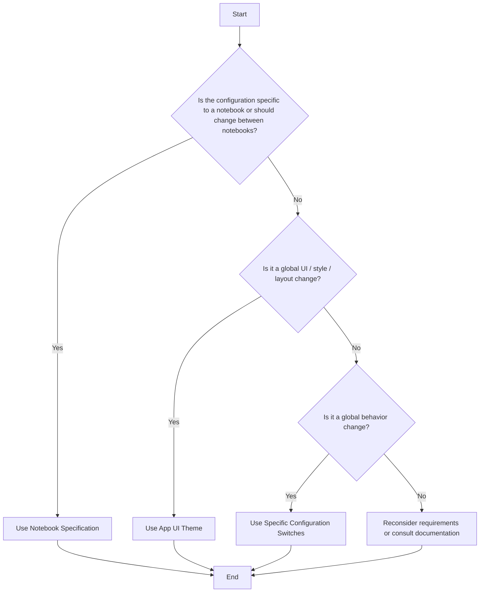

# FAIMS3 Configuration

This document describes the configuration architecture of the FAIMS3 application. The configuration consists of three main components:

1. Notebook Specification: The most comprehensive form of configuration, defining what to render in a notebook, and how. It includes metadata, field definitions, forms, and views/sections. This is used for notebook-specific configurations and can be modified by users through the Designer application.

2. App UI Theme: Global style customization for the mobile application, set through an environment variable. It affects all notebooks and is not user-changeable.

3. Specific Configuration Switches: Environment variables that change global application behavior, applying to all notebooks and not changeable by users.

The document provides guidance on when to use each type of configuration and includes a decision flowchart to help determine the appropriate configuration method for different scenarios.

## FAIMS3 Configuration architecture

Users define a notebook specification using the Designer application. This is combined with a colour and styling specification in the UI theme, along with special configuration switches, to deliver a mobile application with a specialised form.

## Notebook design / specification

The most significant form of configuration in the application is the specification for the notebook. This defines **what** to render, and **how** it should be rendered. A notebook specification includes the following components, as shown in the diagram below

- metadata (`metadata`): a set of key value pairs which contain
  - important notebook metadata such as name, description, author etc
  - configuration switches such as QR code behaviour (TODO document this further)
  - arbitrary user metadata key-value pairs
- field definitions (`ui-specification.fields`): a set of fields with a unique name, this includes detailed specifications on how to render the field, it's allowable returned values etc
- forms (`ui-specification.viewsets`): top level forms which display as discrete forms in the application e.g. Site, Building - these are a collection of views, which are a collection of fields
- views/sections (`ui-specification.fviews`): a sub-section within a form, which contain a collection of Fields identified from the field definitions list by their unique identifier

**When should this be used**: The notebook specification is a powerful form of configuration for the behaviour of a _specific_ notebook. When the behaviour to be configured applies to a) a specific notebook b) individual fields/forms/sections c) some notebooks but not all d) should be configurable by the user within a given deployment, then the notebook specification should be used.

**Note: backwards compatibility**: Making a change to the notebook format should be done in a backwards compatible way if possible - existing functionality should work if the option is missing or has a previous version's implementation. Any change to the format will generally also require an update to the Designer to allow users to customise that option.

A user/developer can therefore change notebook behaviour in the following ways

- changing the metadata for special values (TODO - define these as a special subset of metadata e.g. settings)
- changing the fields or configuration of those fields
- changing the configuration of forms and sections within that form

Ideally, any configuration available in the notebook specification should be exposed in a user-friendly way in the Designer application.

The diagram below shows a simplified structural diagram of a notebook specification JSON document.

## App UI theme

The primary mobile application also supports global style customisation through the use of a UI Theme. Currently, this consists of 'default' and 'bubble'. This theme is provided through an environment variable `VITE_THEME` which corresponds to a folder in `app/src/gui/themes`. Each folder contains a MUI based theme, as well as customised components. This is intended to be extended as we make further component based specialisations moving forward.

**When should this be used**: When the configuration is a global customisation to the app styles, colours, UI theme or layout. The change applies to all notebooks, and should not be changed by the user.

## Specific configuration switches

Currently, in addition to the global UI theme, and notebook specific customisation, there is a small set of environment variable configuration switches which change the behaviour of the application. These include changes to how the authorisation system functions, routes of adjacent components, and specific customisations to layout or app functionality.

**When should this be used**: When the configuration is global, applying to all notebooks, should not be changeable to the user, and does not pertain to layouts, style, colours and the UI.

## Decision process

The below flowchart describes a decision process you could follow to ascertain where configuration should be added.

