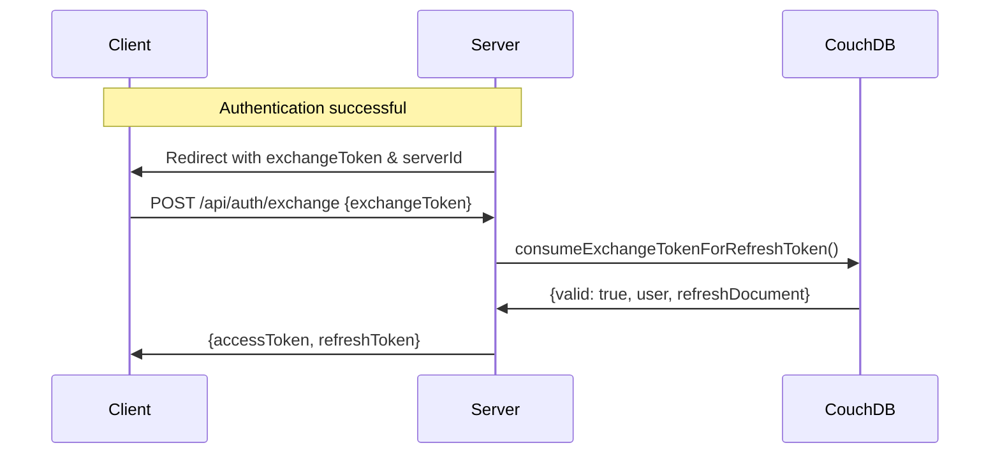
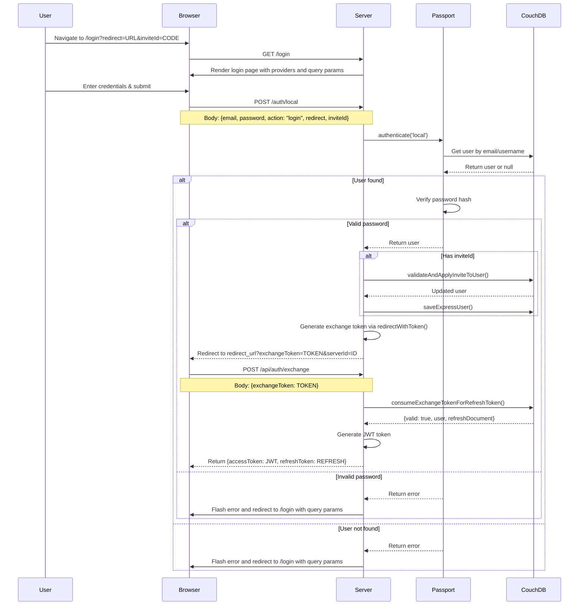
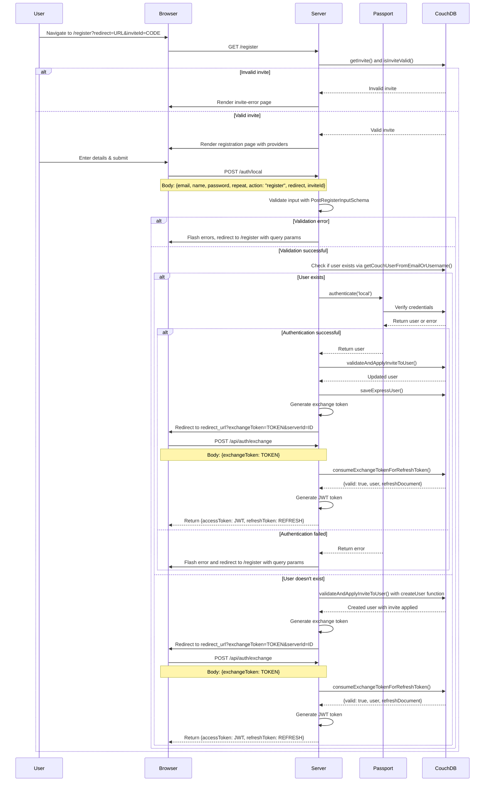
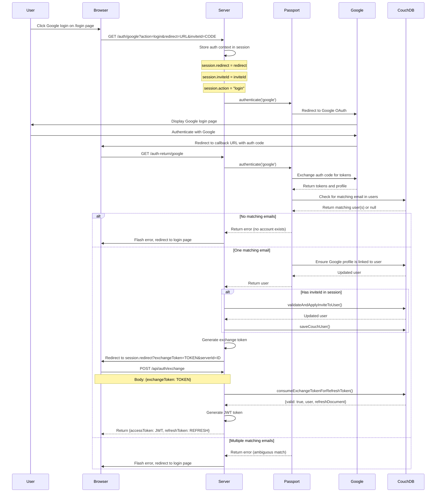
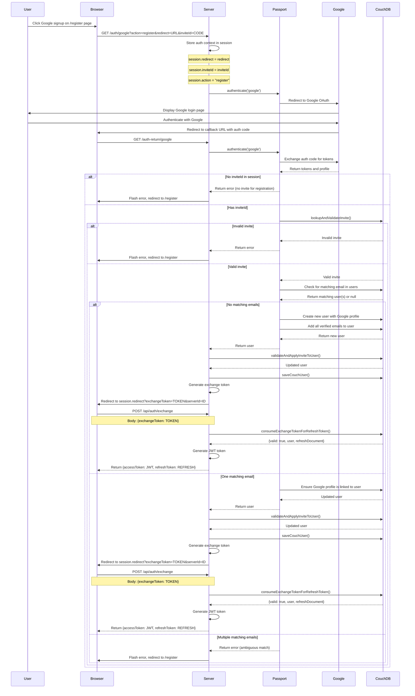

# Authentication System Documentation

This document explains the authentication system built with Passport.js for the FAIMS3 application. The system handles both local authentication (username/password) and federated authentication via social providers (e.g., Google).

## Overview

The authentication system consists of several components:

- Express routes for authentication pages and API endpoints
- Passport.js strategies for various authentication methods
- Session management for storing authentication state
- Token generation for authenticated users
- Token exchange for secure acquisition of access and refresh tokens

## Configuration

The system is configured in `expressSetup.ts` which initializes:

1. Passport.js with appropriate strategies via `applyPassportStrategies`
2. Authentication handlebar **pages** via `addAuthPages`
3. Authentication API **routes** via `addAuthRoutes`

Social providers are defined in `buildconfig.ts` as `CONDUCTOR_AUTH_PROVIDERS`. Auth providers should be referenced via their ID in the `AUTH_PROVIDER_DETAILS` map in `applyStrategies.ts`. A semicolon separated list is used.

## Key Files

- `authPages.ts`: Defines handlebars pages for login and registration pages
- `authRoutes.ts`: Defines API routes for authentication endpoints
- `strategies/applyStrategies.ts`: Configures Passport.js strategies
- `strategies/localStrategy.ts`: Local authentication strategy
- `strategies/googleStrategy.ts`: Google OAuth strategy
- `helpers.ts`: Utility functions for authentication

## Token Exchange System

The authentication system uses a secure token exchange flow to prevent token leakage:

1. After successful authentication, the server generates an **exchange token**
2. The exchange token is delivered to the client via a redirect URL parameter
3. The client then makes a secure API call to exchange this token for:
   - An access token (JWT)
   - A refresh token

This approach improves security by:

- Preventing long-lived tokens from appearing in browser history or logs
- Ensuring the exchange token can only be used once
- Storing exchange tokens as hashes in the database to protect against data breaches

### Exchange Token Flow



## Authentication Flows

### Local Authentication - Login Flow



### Local Authentication - Registration Flow



### Google/Social Authentication - Login Flow



### Google/Social Authentication - Registration Flow



## Key Components

### Authentication Context

The authentication context is passed between routes using query parameters and session storage:

```typescript
// AuthContext contains:
{
  redirect?: string; // Where to redirect after authentication
  inviteId?: string; // Optional invitation code
  action: 'login' | 'register'; // What action to perform
}
```

### Invite System

Invitations are used for registration and to grant access to resources:

1. Invites are validated with `isInviteValid()`
2. Applied to users with `validateAndApplyInviteToUser()`
3. Consumed with `consumeInvite()`

### Token Generation and Exchange

After successful authentication, a token exchange flow is implemented:

1. `createNewRefreshToken()` creates a refresh token with an exchange token
2. `redirectWithToken()` redirects to the client app with the exchange token
3. Client calls `/api/auth/exchange` with the exchange token
4. `consumeExchangeTokenForRefreshToken()` validates and consumes the exchange token
5. Server returns both access token (JWT) and refresh token

The exchange token workflow provides enhanced security:

- Exchange tokens are single-use only (`exchangeTokenUsed: true` after use)
- Exchange tokens are stored as hashes in the database (`exchangeTokenHash`)
- Exchange tokens have the same expiry as the refresh token they're associated with

### Refresh Token Flow

After initial authentication, refresh tokens can be used to obtain new access tokens:

1. Client calls `/api/auth/refresh` with the refresh token
2. Server validates the refresh token and returns a new access token

## URL Validation

The system protects against open redirect vulnerabilities:

1. `validateRedirect()` checks that redirect URLs match whitelist
2. Default redirect URL is used when validation fails

## Error Handling

Errors are handled consistently throughout the authentication flow:

1. Input validation errors are mapped with `handleZodErrors()`
2. Authentication errors are flashed back to the user
3. Security errors return minimal information to prevent information leakage

## Adding a New Provider

To add a new authentication provider:

1. Create a new strategy in `strategies/`
2. Add the provider to `AUTH_PROVIDER_DETAILS` in `applyStrategies.ts`
3. Add the provider to `CONDUCTOR_AUTH_PROVIDERS` in `buildconfig.ts`

## Development Notes

- Local authentication always stores passwords using PBKDF2 with a per-user salt
- Social providers store profile information in `user.profiles[provider]`
- Multiple emails can be associated with a single user account
- The system enforces unique email addresses across all users
- Exchange tokens are one-time use and stored as hashes for security
