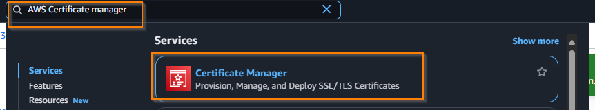

# Deploying AWS Stack from scratch

This guide will explain how to go from an empty AWS account with some basic pre-requisites met, to a complete working FAIMS3 deployment.

Please keep a digital note taking app handy so you can reference some AWS resource IDs (ARNs) as we create some manual resources.

From now on, when I refer to commands in the CLI, assume unless otherwise stated they are running from `infrastructure/aws-cdk` as this is the working directory for the CDK project.

## Installation

Follow the usual repository pre-requisites, i.e. ensure

- docker is installed
- nvm is being used to manage a node v20+

## Repo setup

**From the repo root**, install dependencies as per usual i.e.

```
npm i
```

## AWS Pre-requisites

You will need high level permissions into your target AWS account, active in the current terminal session.

## CDK Bootstrap

Follow the guide at [CDK Bootstrap](https://docs.aws.amazon.com/cdk/v2/guide/bootstrapping-env.html) to bootstrap your AWS account with CDK.

i.e.

```
npm i aws-cdk -g
# ensuring credentials are setup for target AWS account(!)
cdk bootstrap <aws://123456789012/ap-southeast-2>
```

Replacing the AWS account ID above with your actual account. This should result in a stack being deployed successfully. If not, please consult the guide/online advice on any issues encountered.

## Domain name and certificates

The FAIMS stack will be deployed to a given base domain, with a wildcard set of subdomains. For this reason you will need the following

- a route 53 managed domain name (i.e. a route53 hosted zone of which CDK can programmatically add routes - the domain itself may not need to be purchased via Amazon's registry, but it needs to be deleted to a Route53 hosted zone)
- target region certificates for the **base domain and subdomains** - for example if you wish to deploy to `my-faims.com` you will need `my-faims.com` and `*.my-faims.com` in **both the target deployment region, and us-east-1**. You always need `us-east-1` because Cloudfront always uses US certs.

Setting up your domain names, and route 53 hosted zone is an issue that is quite specific to your context. However, I would recommend you have an entire hosted zone dedicated to this application if possible, so that CDK can fully manage it.

### Creating certificates

Navigate to AWS Certificate manager - **ensure you are in the target app deployment region**.



Then select request certificate on the left panel, request a public certificate.

Enter the following settings. In (1) include your base domain e.g. test.com. In (2), include the wildcard subdomains i.e. '\*.test.com'.


Then add some tags if you like, and submit the cert.

Once submitted, click the "Create records in Route 53 button" - ensuring you have a managed hosted zone with control over the target domain.

**Note down the ARN of the certificate**. You can find it/copy it as below:


Repeat this process, but using the `us-east-1` region, and note down the certificate ARN separately.

You should now have two validated certificates, and a target domain name noted down.

## Creating your configuration repository

The CDK deployment refers to a remote repository to manage configuration files. Configuration files are extensively documented in the `README` of the `infrastructure/aws-cdk` folder in the source code.

In short, create a private repository, and create the following files/structure within it

```
.
├── infrastructure
│   └── dev
│       └── configs
│           └── dev.json
└── README.md
```

Replacing `dev` with your proposed stage. There can be multiple stages, as in this example. I am going to deploy the `prod` stage.

```
.
├── infrastructure
│   ├── dev
│   │   └── configs
│   │       └── dev.json
│   └── prod
│       └── configs
│           └── prod.json
└── README.md
```

Use the `sample.json` in `infrastructure/aws-cdk/configs/sample.json` as a starting point for your configuration json.

From now on, when I refer to updating values in the `config json` - this is the file I am referring to. **Ensure you sync your changes using the config script in the infrastructure/aws-cdk package to pull/push the latest changes to your deployment context as you go!**.

Validate that you can pull the config by running

```
./config.sh
./config.sh pull prod --config_repo git@github.com:repo-org/repo-name.git
```

assuming you use SSH for git authentication. `prod` being replaced with your stage. After you do this once, you can push pull without the config repo argument.

Now, when we edit the config json, just change it directly in your configs/<file.json> path, and push the changes using

```
./config.sh push prod
```

## Updating domain names and certs in config

Now update the following values in your config json

### Stack name

Set this to a nice short ID for the whole deployment. Changing this will require re-deploying the entire app! So choose something reasonable. It is just an identifier, it does not effect the app and is not displayed anywhere.

```json
  "stackName": "YourStackName",
```

### Hosted zone

Enter the domain and ID of the hosted zone, as above

```json
  "hostedZone": {
    "id": "your-hosted-zone-id",
    "name": "your-domain.com"
  },
```

You can find these in the hosted zones menu as below:


