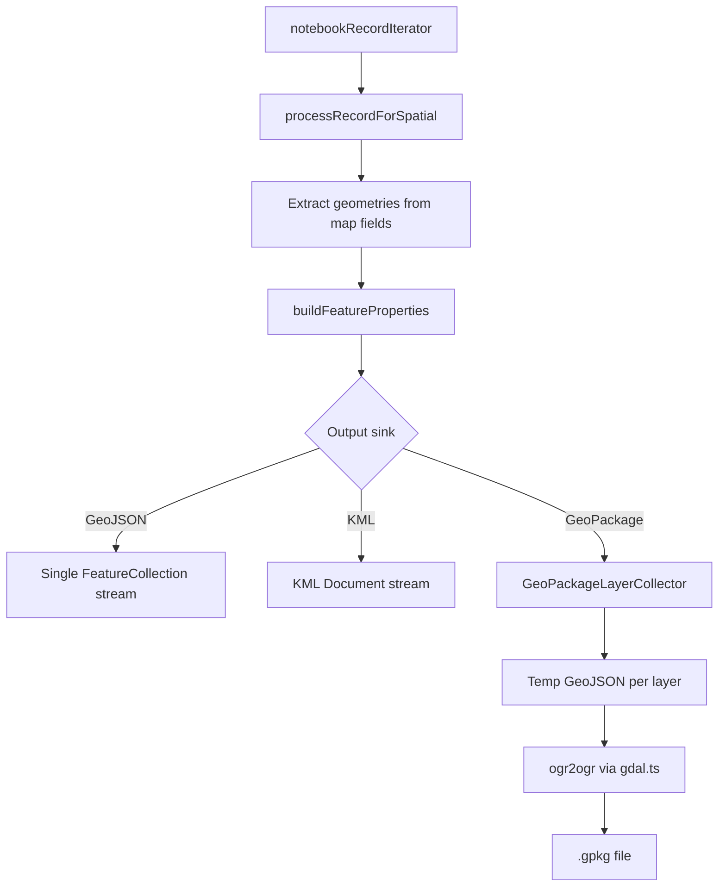

# Geospatial export pipeline

How the API turns notebook map fields into GeoJSON, KML, and GeoPackage (`.gpkg`) files.

## Formats and entry points

| Format     | MIME / extension                               | Typical use               |
| ---------- | ---------------------------------------------- | ------------------------- |
| GeoJSON    | `application/geo+json`, `.geojson`             | Web maps, modern GIS      |
| KML        | `application/vnd.google-earth.kml+xml`, `.kml` | Google Earth              |
| GeoPackage | `application/geopackage+sqlite3`, `.gpkg`      | QGIS, ArcGIS, desktop GIS |

**HTTP (signed download token)** — `GET /api/notebooks/:id/records/export?format=…`

- `geojson`, `kml`, `geopackage` — one format, streamed to the client
- `full` — ZIP archive; spatial formats controlled by `includeGeoJSON`, `includeKML`, `includeGeoPackage` (all default `true`)

**Implementation files** (under `api/src/couchdb/export/`):

| File                  | Role                                                                         |
| --------------------- | ---------------------------------------------------------------------------- |
| `geospatialExport.ts` | Record iteration, feature extraction, format writers, archive fan-out        |
| `gdal.ts`             | `ogr2ogr` wrapper for GeoPackage conversion                                  |
| `fullExport.ts`       | Full ZIP orchestration (calls spatial export once for all requested formats) |
| `types.ts`            | `FullExportConfig` including `includeGeoPackage`                             |

Web UI: project export form and full-export checkboxes in `web/src/components/forms/`.

## Pipeline overview

Every export path funnels through **`iterateSpatialFeatures`**: one walk over notebook records, one call to `onFeature` per geometry. Archive exports use **`appendSpatialFormatsToArchive`**, which fans the same features to every enabled format in that single pass (no second DB scan when full export requests GeoJSON + KML + GeoPackage together).

## Record → feature

1. **`initSpatialExportContext`** — loads UI spec, builds `viewFieldsMap`, sets `hasSpatialFields`.
2. **`notebookRecordIterator`** — hydrates records (attachments excluded for export).
3. **`processRecordForSpatial`** — for each spatial field on the record's form:
   - Reads GeoJSON from the field value (`Feature` or first feature of `FeatureCollection`)
   - Builds tabular properties via `convertDataForOutput` (same columns as CSV export)
   - Adds geometry-source metadata (`geometry_source_field_id`, etc.)
4. **`buildFeatureProperties`** — merges record properties with geometry-source fields.

Unsupported geometry types (e.g. `GeometryCollection`) are skipped with a console warning.

## GeoJSON and KML

- **GeoJSON**: one `FeatureCollection`; features written incrementally to a stream.
- **KML**: one `Document`; each geometry becomes a `Placemark` named with the record HRID.

Both are true streams for standalone download. In a full ZIP they use `PassThrough` streams appended to the archiver.

## GeoPackage

GeoPackage is **not** streamed end-to-end:

1. During iteration, **`GeoPackageLayerCollector`** writes features into **one temp GeoJSON file per layer**.
2. Layer name: `{form_id}_{geometry_type}` (e.g. `site_survey_point`). `Point` and `MultiPoint` share the `point` suffix; names are sanitised and capped at 63 characters.
3. After iteration, **`convertLayeredGeoJsonToGeoPackage`** (`gdal.ts`) runs `ogr2ogr` once per layer (first creates the `.gpkg`, rest append).
4. The finished `.gpkg` is read from disk and appended to the archive or HTTP response.

**Requirement:** GDAL on PATH (`ogr2ogr`). Included in API Docker image and devcontainer; optional on native dev (`gdal-bin` / Homebrew `gdal`). `./dev.sh` warns if missing.

## Full export behaviour

`streamFullExport` builds a `SpatialArchiveFormatConfig` from `FullExportConfig` and calls **`appendSpatialFormatsToArchive` once**. Spatial files land under `spatial/export.geojson`, `spatial/export.kml`, and/or `spatial/export.gpkg` inside the ZIP.

If the notebook has no map fields, spatial files are omitted and warnings are recorded in export metadata.

## Developer tooling

**Bulk test records** (`DEVELOPER_MODE`, `POST /api/notebooks/:id/generate`):

- Map fields get random geometries in mainland Australia
- `includeAttachments` and `parallelism` control speed vs load

See also [TestDatasetSeeding](TestDatasetSeeding.md) for seeded projects.

## Testing and extension

- **Unit tests:** `api/test/geopackageExport.test.ts` — layer naming only (no GDAL in CI).
- **Manual:** export a notebook with Point/Line/Polygon map fields; open `.gpkg` in QGIS.

To add a new spatial format: hook into `iterateSpatialFeatures` or extend `appendSpatialFormatsToArchive` with another sink in the fan-out callback. Keep one record iteration for combined archive exports.

## Related docs

- [Records CRUD API](RecordsCRUDApi.md) — per-record reads; bulk files use export API
- User-facing overview: `docs/user/data-export/export.md`
