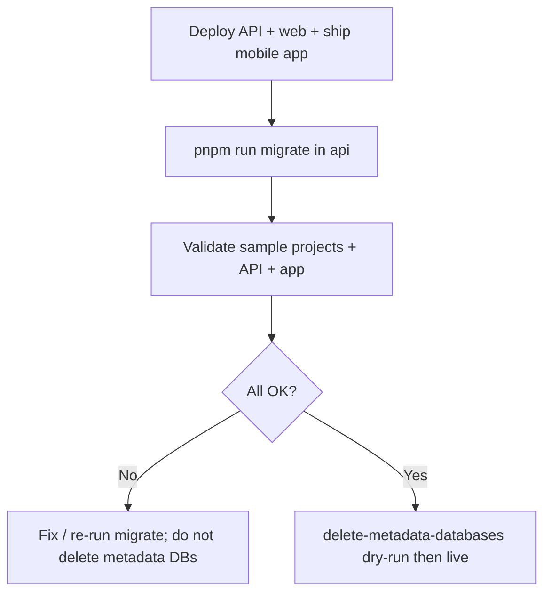

# Metadata overhaul — deployment and migration guide

This guide is for operators upgrading an existing FAIMS3 deployment to the release that **inlines notebook definitions** on project/template Couch documents (projects DB **v4**, templates DB **v5**) and retires per-project **`metadata-{projectId}`** databases.

For the target data model, see [Notebook definition](./NotebookDefinition.md). For schema-version mechanics, see [Notebook migrations](./NotebookMigrations.md) and [Couch migrations](./CouchMigrations.md).

## Which versions does this apply to?

|          |                                                                                                     |
| -------- | --------------------------------------------------------------------------------------------------- |
| **From** | Any deployment on **v1.5.2 or earlier** — i.e. projects DB **≤ v3** and templates DB **≤ v4**.      |
| **To**   | The first release containing the metadata overhaul (the **metadata-overhaul** release; **v1.6.0**). |

If your deployment is already on a release whose projects DB is at **v4** and templates DB is at **v5**, this migration has already run and you can skip it. You can confirm the schema versions in the per-DB migration documents (see [Couch migrations](./CouchMigrations.md)) or in `DB_TARGET_VERSIONS` in `library/data-model/src/data_storage/migrations/migrations.ts`.

## Background — the model this replaces

Knowing the previous shape helps when validating the migration and reading older code/data.

**Before this change (projects DB ≤ v3, templates DB ≤ v4):**

- Each survey/project had its **own dedicated Couch database** named `metadata-{projectId}`, separate from its `data-{projectId}` records database.
- That metadata DB held the notebook design split across multiple documents: a single **`ui-specification`** document (encoded form/view spec) plus one **`project-metadata-{key}`** document per metadata key (name, description, lead institution, etc.).
- The **project document** in the `projects` DB only _referenced_ that database via a **`metadataDb`** pointer (historically `metadata_db`); it did **not** contain the notebook definition itself.
- **Templates** stored their design differently again — as two fields on the template document: a `ui-specification` object and a loosely-typed `metadata` object.

**After this change (projects DB v4, templates DB v5):**

- The whole notebook definition (decoded `uiSpec` + typed `metadata`) is **inlined** into a single **`uiSpecification`** object on the project/template document.
- The `metadataDb` pointer is dropped, the split `project-metadata-*` / `ui-specification` docs are merged and normalised to the current notebook schema, and the per-project **`metadata-{projectId}`** databases are retired (deleted in step 4).
- Projects/templates gain root-level audit fields (`createdBy`, `createdAt`, `updatedAt`) and an optional root `description`.

This consolidation is what the two migration layers below carry out.

---

There are **two migration layers** — run both in order:

| Layer              | What moves                                                     | How                                                                                  |
| ------------------ | -------------------------------------------------------------- | ------------------------------------------------------------------------------------ |
| **Couch document** | Project/template rows: inline former metadata, adds new fields | `pnpm run migrate` in `api/` (`projectsV3toV4Migration`, `templatesV4toV5Migration`) |
| **Notebook JSON**  | Design bundle → current schema (`uiSpec` + typed `metadata`)   | `migrateNotebook` via API normalisation, optional startup pass, clients on load      |

---

## 1. Deploy updated services (sync API, web, mobile)

Attempt to coordinate step 1/2 below.

**Note** There is a risk of incompatibilities if the app and API release are not synchronised. There are various breaking changes

- notebook listing API shapes
- notebook listing API field names (e.g. uiSpecification instead of 'ui-specification')
- field name changes and deprecations
- encoded notebook version changes (`fviews` vs `views`)

The app behaviour is likely to be unstable or completely broken when the app is on v1.5.2 or prior while the backend is ahead, and vice versa.

1. **Deploy Conductor (API)** and **Control Centre (web)** together. The web designer and JSON upload paths expect the new API routes (`PUT …/uiSpecification`, partial `PUT …/:id` for name/description).
2. **Release mobile app builds** that include this branch (or newer).
3. Confirm environment for optional notebook re-migration on API boot (defaults **on**):

   ```bash
   MIGRATE_NOTEBOOKS_ON_STARTUP=true   # default when unset
   ```

   When `true`, each API startup runs `validateDatabases`, which migrates any project whose inlined `uiSpecification` is still below the current notebook schema version (see §5 below).

4. **Do not delete `metadata-*` Couch databases** until Couch document migration has completed and you have validated samples (see §3).

---

## 2. Run Couch database migration

Couch migrations for **projects** and **templates** are **not** applied automatically when the API process starts listening. Run the migration script explicitly against the target Couch instance.

From the repository root (with env pointing at the deployment CouchDB):

```bash
cd api
# Ensure your .env file is accurately targetting your DB
pnpm run migrate          # structure + migrations; no JWT key push
# or, when keys must be (re)written:
pnpm run migrate-with-keys
```

This calls `initialiseAndMigrateDBs` (`api/src/couchdb/index.ts`), which:

- Ensures global DBs exist (directory, people, projects, templates, …).
- Runs `migrateDbs` until **projects** reach version **4** and **templates** version **5**.
- For each v3 project, **`projectsV3toV4Migration`** opens the legacy **`metadata-{projectId}`** database, merges `ui-specification` + `project-metadata-*` docs, runs **`migrateNotebook`** to the current schema version, and writes **`uiSpecification`** on the project document (and removes **`metadataDb`**).

**Migration audit fields:** `createdBy` / `createdAt` / `updatedAt` on projects and templates may be filled from migration context when legacy data has no creator (`MigrationContext.migrationCreatedBy` / `DEFAULT_MIGRATION_CREATED_BY`). Historical surveys still have no trustworthy creator in old metadata; do not treat `metadata.information.projectLeadLabel` as `createdBy`.

**NOTE**: This migration introduces new fields which have no reliable source (who created, when created) - these are initialised to placeholder values. For critical resources, administrators may need to manually correct these.

---

## 3. Validate migration success

Check a **representative sample** of surveys and templates to build confidence in migration.

### 3.1 Project / template Couch documents

For each sampled project in the **`projects`** database:

| Check                                 | Expected                                                                 |
| ------------------------------------- | ------------------------------------------------------------------------ |
| Document version                      | Projects DB migration complete (no pending migration doc errors in logs) |
| `metadataDb` / `metadata_db`          | **Absent** on v4 documents                                               |
| `uiSpecification`                     | **Present** object with `uiSpec` and `metadata`                          |
| `description`                         | Optional string at **root** (operational blurb, max 250 chars when set)  |
| `createdBy`, `createdAt`, `updatedAt` | Present (strings; ISO timestamps for dates)                              |
| `dataDb`                              | Unchanged (`db_name` → `data-{projectId}`)                               |

Templates: same for **`uiSpecification`**, plus `version`, `archived`, `isPublic`; no `dataDb`.

### 3.2 Notebook definition shape (current schema)

Inside `uiSpecification`:

| Path                                         | Expected                                                                                                 |
| -------------------------------------------- | -------------------------------------------------------------------------------------------------------- |
| `uiSpec.schemaVersion`                       | Matches **`CURRENT_NOTEBOOK_UI_SCHEMA_VERSION`**                                                         |
| `uiSpec.views`                               | Object (decoded from legacy `fviews`; not `fviews` on persisted doc)                                     |
| `uiSpec.settings.showQrCodeButton`           | **boolean**                                                                                              |
| `metadata.information`                       | Object with `notebookVersion`, `purposeMarkdown`, `projectLeadLabel`, `leadInstitution` (camelCase keys) |
| `metadata.information.derivedFromTemplateId` | Optional string when provenance existed                                                                  |
| `metadata.custom`                            | Optional; only for unmapped legacy keys                                                                  |

**Should not appear** on the persisted bundle: top-level legacy `metadata.name`, `metadata.schema_version`, `metadata.showQRCodeButton`, `metadata.pre_description`, `template_id` inside metadata, `project-metadata-*` docs (once metadata DBs are removed).

### 3.3 Mobile app

1. Install the **new** app build.
2. Open a migrated survey: first launch after upgrade runs **redux-persist migration** (`migrateProjectsPersistedState`) on cached project state, then syncs from API (`projectInformationFromGetNotebook` → `normalizeNotebookUiSpecification`).
3. Confirm forms render and notebook summary shows root `description` (when set) / design
   fields as expected.

### 3.4 Metadata database cleanup dry-run

From `api/`:

```bash
pnpm run delete-metadata-databases -- --dry-run
```

Review output: each `metadata-{projectId}` should show **`hasInlinedUiSpecification: true`** and ideally **`stillReferencedOnProject: false`**. Investigate any project flagged as missing `uiSpecification` before deleting.

---

## 4. Remove legacy metadata databases

When §3 validation passes:

```bash
cd api
pnpm run delete-metadata-databases -- --dry-run   # review
pnpm run delete-metadata-databases              # interactive confirmation
```

This destroys Couch databases whose names start with `metadata-`. **Irreversible** — ensure backups exist and [§3](#3-validate-migration-success) is satisfied.

Per-project **data** databases (`data-{projectId}`) are **not** removed.

---

## 5. Notebook JSON migration — when it runs

The current notebook schema version is applied by `migrateNotebook` (often wrapped in `normalizeNotebookUiSpecification`). Below is where that runs in this branch.

### Server — persists to Couch

| Trigger                                      | Location                                                | Notes                                                                                    |
| -------------------------------------------- | ------------------------------------------------------- | ---------------------------------------------------------------------------------------- |
| **POST** create survey (from scratch)        | `createNotebook` in `api/src/couchdb/notebooks.ts`      | Body `name`, optional `description` (max 250), `uiSpecification`; legacy wire accepted   |
| **POST** create survey (from template)       | Copies `template.uiSpecification` only                  | Optional `description` on POST is **not** taken from the template                        |
| **PUT** `/api/notebooks/:id/uiSpecification` | `updateProjectUiSpecification`                          | Designer save, full JSON replace                                                         |
| **PUT** `/api/templates/:id/uiSpecification` | Template equivalent                                     |                                                                                          |
| **POST** create template                     | `createTemplate`                                        | Body `name`, optional `description` (max 250), `uiSpecification`                         |
| **Projects DB v3 → v4**                      | `projectsV3toV4Migration`                               | Reads metadata DB + `migrateNotebook`                                                    |
| **Templates DB v4 → v5**                     | `templatesV4toV5Migration`                              | Same pattern for templates                                                               |
| **API startup** (optional)                   | `validateDatabases` when `MIGRATE_NOTEBOOKS_ON_STARTUP` | Re-writes projects whose inlined spec version is still behind the current schema version |

**Does not migrate on server:**

- **`PUT /api/notebooks/:id`** — only optional `name` / `description` (root metadata, max 250 chars when set).

### Web Control Centre / designer — in browser

| Trigger                               | Location                                                        | Persists?                                               |
| ------------------------------------- | --------------------------------------------------------------- | ------------------------------------------------------- |
| Open designer                         | `toDesignerNotebookWithHistory` → `normalizeApiUiSpecification` | In memory until save                                    |
| Save designer                         | `PUT …/uiSpecification`                                         | Yes (server normalises again)                           |
| Create survey/template from JSON file | `prepareNotebookUiSpecificationInputForApi` then POST           | Server migrates on create                               |
| Replace JSON file                     | `prepareNotebookUiSpecificationInputForApi` then PUT            | Server migrates on replace (same loose input as create) |

### Mobile app

| Trigger                                   | Location                                        | Persists?                             |
| ----------------------------------------- | ----------------------------------------------- | ------------------------------------- |
| **First boot after upgrade**              | `migrateProjectsPersistedState` (redux-persist) | Local cache only                      |
| **Fetch survey** from API                 | `projectInformationFromGetNotebook`             | Local state; server already canonical |
| Legacy cached project (no `uiDefinition`) | `notebookDefinitionFromLegacyPersistedProject`  | Local                                 |

After server migration, apps **refresh** when users sync/open surveys; persisted Redux state is upgraded on rehydrate.

## 6. Suggested rollout order (summary)


