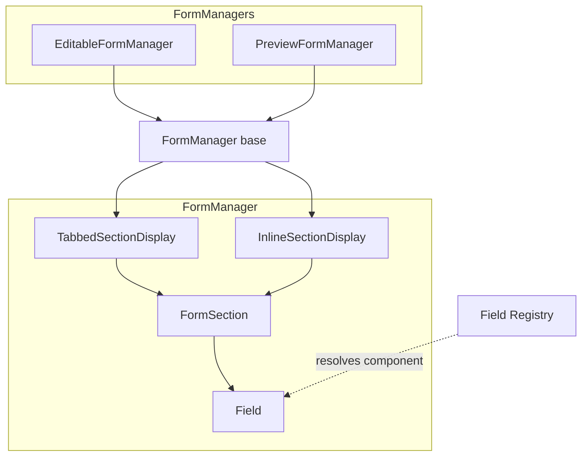
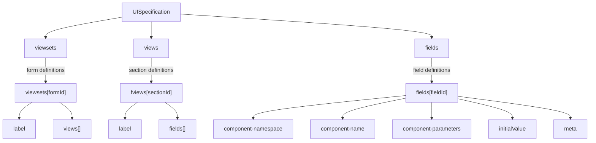

# Forms Module Overview

## Purpose

The Forms Module renders dynamic forms from a UI specification (`UISpec`) and handles data capture. It supports two operational modes: **editable** (data entry), **preview** (for testing out fields - non persisted form), **view** (read-only data display for existing records).

## Architecture



## Key Dependencies

| Library                 | Purpose                                                  |
| ----------------------- | -------------------------------------------------------- |
| `@tanstack/react-form`  | Form state management, field binding, change tracking    |
| `@tanstack/react-query` | Async data fetching, caching, mutations                  |
| `zod`                   | Schema validation for field props and data               |
| `@mui/material`         | UI components                                            |
| `@faims3/data-model`    | Shared types, UISpec definitions, data engine interfaces |

## Module Structure

```
lib/
├── formModule/
│   ├── formManagers/       # EditableFormManager, PreviewFormManager, FormManager
│   ├── sections/           # TabbedSections, InlineSections, FormSection
│   ├── Field.tsx           # Field renderer (resolves from registry)
│   ├── Annotation.tsx      # Field annotation UI
│   └── types.ts            # FaimsForm, FieldSpecification types
├── fieldRegistry/
│   ├── registry.ts         # Field type registry
│   ├── fields/             # Individual field implementations
│   └── types.ts            # FieldInfo, FieldReturnType
├── rendering/
│   ├── DataView.tsx        # Read-only form renderer
│   └── fields/view/        # View-mode field renderers
├── validationModule/
│   └── validation.ts       # Zod schema compilation, validation utilities
└── hooks/
    ├── useAttachment.ts    # Attachment loading hook
    └── useElementWidth.ts  # Responsive layout hook
```

## Data Flow

## UISpec Structure

The UISpec defines the form structure hierarchically - this is reflected in how the form managers resolve a form -> sections and fields.



| Level      | Key        | Description                                                                    |
| ---------- | ---------- | ------------------------------------------------------------------------------ |
| `viewsets` | Form ID    | Defines a complete form with ordered sections                                  |
| `fviews`   | Section ID | Groups related fields into a section (fviews when encoded, views when decoded) |
| `fields`   | Field ID   | Individual field configuration                                                 |

## Configuration Modes

Form configuration modes - full mode is used in the `EditableFormManager` for a
complete edit mode. `preview` is used in the `PreviewFormManager` for testing
out fields without data persistence.

| Mode      | Manager               | Use Case                              |
| --------- | --------------------- | ------------------------------------- |
| `full`    | `EditableFormManager` | Live data entry with backend sync     |
| `preview` | `PreviewFormManager`  | Form designer preview, no persistence |

## Layout Options

The form has two layout modes, which can be configured in the designer/ui-spec.
The Form will adapt to this layout and show sections differently.

| Layout   | Component              | Behaviour                                      |
| -------- | ---------------------- | ---------------------------------------------- |
| `tabs`   | `TabbedSectionDisplay` | Horizontal tabs, one section visible at a time |
| `inline` | `InlineSectionDisplay` | Vertical stack, all sections visible           |
