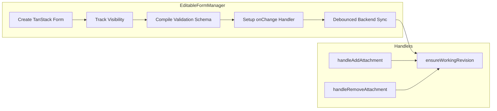

# Form Managers

## Overview

Form managers orchestrate form rendering and state management. Three managers exist in a hierarchy:


## FormManager (Base)

The base rendering component. Receives a configured TanStack Form instance and renders sections.

### Props

| Prop | Type | Description |
|------|------|-------------|
| `formName` | `string` | Form/viewset ID from UISpec |
| `form` | `FaimsForm` | TanStack Form instance |
| `uiSpec` | `ProjectUIModel` | UI specification |
| `config` | `FormManagerConfig` | Mode and feature configuration |
| `fieldVisibilityMap` | `FieldVisibilityMap \| undefined` | Visible fields per section |
| `debugMode` | `boolean` | Show form state debugger |

### Behaviour

1. Looks up form spec from `uiSpec.viewsets[formName]`
2. Selects layout renderer based on `config.layout`
3. Passes visibility map to section components
4. Optionally renders `FormStateDisplay` for debugging

```typescript
// Layout selection
{config.layout === 'inline' && <InlineSectionDisplay ... />}
{config.layout === 'tabs' && <TabbedSectionDisplay ... />}
```

## EditableFormManager

Full-featured form manager with backend synchronisation.

### Props

| Prop | Type | Description |
|------|------|-------------|
| `recordId` | `string` | Record being edited |
| `activeUser` | `string` | Current user identifier |
| `initialData` | `FaimsFormData` | Pre-populated form values |
| `existingRecord` | `HydratedRecordDocument` | Full record context |
| `revisionId` | `string` | Starting revision ID |
| `mode` | `AvpUpdateMode` | `'new'` \| `'parent'` |
| `config` | `FullFormConfig` | Injected dependencies |
| `navigationContext` | `FormNavigationContext` | Parent/child navigation state |
| `onReady` | `(handle) => void` | Callback with form control handle |

### Responsibilities



### Revision Management (AVP Strategy)

The manager implements Attribute-Value-Pair versioning:

| Mode | First Edit Behaviour |
|------|---------------------|
| `new` | Edits apply directly to current revision |
| `parent` | Creates child revision, then applies edits |

```typescript
// In 'parent' mode, first edit triggers revision creation
if (!edited && props.mode === 'parent') {
  const newRevision = await dataEngine.form.createRevision({
    recordId: props.recordId,
    revisionId: workingRevisionId,
    createdBy: props.activeUser,
  });
  setWorkingRevisionId(newRevision._id);
}
```

### Validation Modes

| Mode | Applies To | Use Case |
|------|-----------|----------|
| `FULL` | All visible fields | Existing records (`mode: 'parent'`) |
| `ONLY_TOUCHED` | Fields user has interacted with | New records (`mode: 'new'`) |

### Auto-Save

Changes are debounced and synced automatically:

```typescript
const FORM_SYNC_DEBOUNCE_MS = 1000;

// Debounced save triggered on form changes
const debouncedSave = debounce(async (values) => {
  await dataEngine.form.updateFormData({
    recordId,
    revisionId: workingRevisionId,
    data: values,
  });
}, FORM_SYNC_DEBOUNCE_MS);
```

### Handle API

The `onReady` callback receives a handle for external control:

```typescript
interface EditableFormManagerHandle {
  flushSave: () => Promise<void>;    // Force immediate save
  hasPendingChanges: () => boolean;  // Check for unsaved changes
}
```

Use `flushSave()` before navigation to prevent data loss.

## PreviewFormManager

Lightweight manager for form designer previews.

### Props

| Prop | Type | Description |
|------|------|-------------|
| `formName` | `string` | Form/viewset ID |
| `uiSpec` | `ProjectUIModel` | UI specification |
| `layout` | `'inline' \| 'tabs'` | Layout mode |

### Behaviour

- Creates isolated TanStack Form instance
- No backend connection
- Fields render in preview mode (mock handlers)
- No navigation context

## Configuration Types

### FormManagerConfig

Discriminated union based on mode:

```typescript
type FormManagerConfig = FullFormManagerConfig | PreviewFormManagerConfig;
```

### FullFormManagerConfig

```typescript
interface FullFormManagerConfig extends FullFormConfig {
  navigationContext: FormNavigationContext;
  attachmentHandlers: {
    addAttachment: (params) => Promise<string>;
    removeAttachment: (params) => Promise<void>;
  };
  trigger: {
    commit: () => Promise<void>;
  };
}
```

### PreviewFormManagerConfig

```typescript
interface PreviewFormManagerConfig {
  mode: 'preview';
  layout: 'inline' | 'tabs';
}
```

## Navigation Context

Tracks parent-child record relationships for navigation:

```typescript
type FormNavigationContext = 
  | { mode: 'root'; scrollTarget?: RedirectInfo }
  | { mode: 'child'; lineage: FormNavigationChildEntry[]; scrollTarget?: RedirectInfo };
```

### Lineage Entry

```typescript
interface FormNavigationChildEntry {
  recordId: string;
  revisionId?: string;
  parentMode: 'parent' | 'new';
  relationType: 'parent' | 'linked';
  fieldId: string;
}
```

Used by:
- `NavigationBreadcrumbs` - shows path back to parent
- `NavigationButtons` - provides return navigation
- `RelatedRecordField` - adds entries when navigating to children
