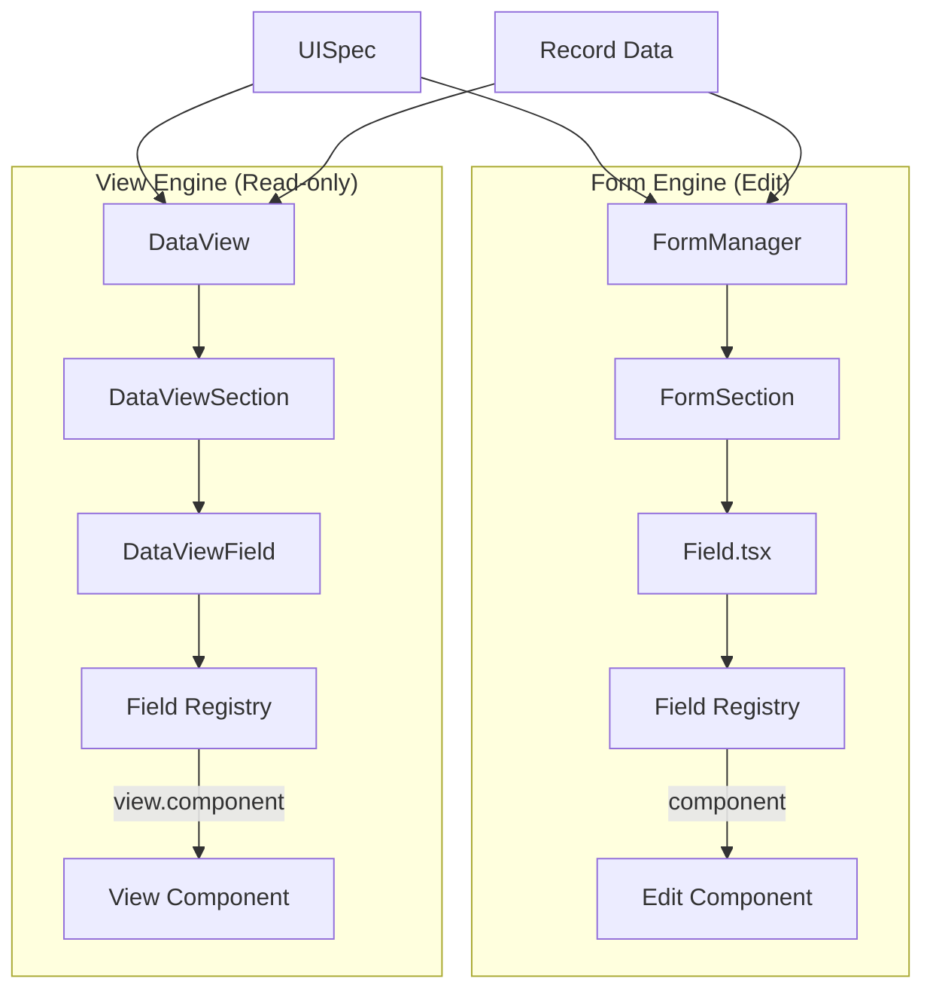
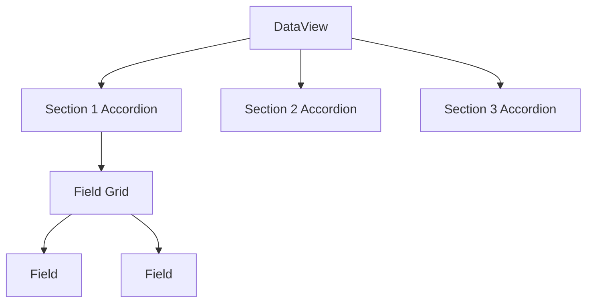

# Form Engine vs View Engine

## Overview

The module provides two distinct rendering paths:

| Engine | Purpose | Entry Point | Field Source |
|--------|---------|-------------|--------------|
| **Form Engine** | Data entry | `FormManager` | `FieldInfo.component` |
| **View Engine** | Read-only display | `DataView` | `FieldInfo.view.component` |



## Form Engine

### Purpose

Interactive data entry with:
- Two-way binding via TanStack Form
- Validation feedback
- Attachment handling
- Auto-save

### Component Resolution

```typescript
// Field.tsx
const fieldInfo = getFieldInfo({
  namespace: fieldSpec['component-namespace'],
  name: fieldSpec['component-name'],
});

const Component = fieldInfo?.component;
```

### Props Injected to Edit Components

```typescript
interface FormFieldContextProps {
  fieldId: string;
  state: FaimsFormFieldState;           // TanStack field state
  setFieldData: (value: any) => void;   // Update data portion
  setFieldAnnotation: (value) => void;  // Update annotation
  addAttachment: (params) => Promise<string>;
  removeAttachment: (params) => Promise<void>;
  handleBlur: () => void;               // Touch tracking
  config: FormConfig;                   // Mode context
  trigger: { commit: () => Promise<void> };
}
```

### Field State Structure

Each field's state contains:

```typescript
interface FormDataEntry {
  data?: any;                    // Field value
  annotation?: FormAnnotation;   // User notes
  attachments?: FaimsAttachments; // File references
}
```

## View Engine

### Purpose

Read-only display of submitted records:
- No editing capability
- Optimised for presentation
- Supports nested record expansion (RelatedRecords)

### Component Resolution

```typescript
// DataView resolves from same registry, different property
const fieldInfo = getFieldInfo({ namespace, name });
const ViewComponent = fieldInfo?.view.component;
```

### Props Injected to View Components

```typescript
interface DataViewFieldRenderProps {
  value: any;                           // The data value
  annotation?: FormAnnotation;          // User annotations
  attachments: FaimsAttachments;        // Attachment metadata
  config: DataViewFieldRenderConfiguration;
  renderContext: DataViewFieldRenderContext;
}
```

### Render Context

```typescript
interface DataViewFieldRenderContext {
  viewsetId: string;
  viewId: string;
  fieldId: string;
  hrid: string;                         // Human-readable record ID
  record: HydratedRecordDocument;
  uiSpecification: ProjectUIModel;
  trace: DataViewTraceEntry[];          // Nesting history
  tools: DataViewTools;                 // Navigation, services
  formData: FormUpdateData;
  fieldName: string;
  fieldNamespace: string;
}
```

### DataViewTools

```typescript
interface DataViewTools {
  navigateToRecord: (params) => void;
  getRecordRoute: (params) => string;
  getDataEngine: () => DataEngine;
  getAttachmentService: () => IAttachmentService;
  editRecordButtonComponent: React.FC<{recordId: string}>;
}
```

## Dual Registration

Fields register both edit and view components:

```typescript
const textFieldSpec: FieldInfo = {
  namespace: 'formio-core',
  name: 'textfield',
  returns: 'faims-core::String',
  
  // Edit mode component
  component: TextFieldComponent,
  
  // View mode component
  view: {
    component: TextFieldRenderer,
    config: {},
    attributes: { singleColumn: false }
  },
  
  fieldPropsSchema: textFieldPropsSchema,
  fieldDataSchemaFunction: (props) => z.string(),
};
```

## View Attributes

Control view rendering behaviour:

```typescript
interface DataViewFieldRenderAttributes {
  bypassNullChecks?: boolean;  // Render even if value is null
  singleColumn?: boolean;      // Force full-width layout
}
```

| Attribute | Default | Effect |
|-----------|---------|--------|
| `bypassNullChecks` | `false` | Skip rendering if value is null/empty |
| `singleColumn` | `false` | Use two-column grid layout |

## Visibility Handling

Both engines respect conditional visibility from UISpec:

```typescript
// Form Engine
const visibleMap = currentlyVisibleMap({
  values: formDataExtractor({ fullData: initialData }),
  uiSpec: dataEngine.uiSpec,
  viewsetId: formId,
});

// View Engine
const visibleFields = currentlyVisibleFields({
  uiSpec: props.uiSpecification,
  values: formDataExtractor({ fullData: props.formData }),
  viewsetId: props.viewsetId,
});
```

## Layout Differences

### Form Engine Layouts

| Layout | Sections | Navigation |
|--------|----------|------------|
| `tabs` | One visible at a time | Tab bar / stepper |
| `inline` | All visible | Vertical scroll |

### View Engine Layout

Always uses accordion-based sections:



## Nesting (View Engine)

The view engine supports nested record rendering via trace tracking:

```typescript
interface DataViewTraceEntry {
  recordId: string;
  viewsetId: string;
  viewId: string;
  fieldId: string;
  callType: 'relatedRecord';
}
```

Prevents infinite loops with:
1. **Depth limit**: `RENDER_NEST_LIMIT = 2`
2. **Cycle detection**: Checks if record ID exists in ancestor trace

```typescript
const ancestorIds = new Set(trace.map(t => t.recordId));
const isCycle = ancestorIds.has(targetRecordId);
const isDepthLimitReached = trace.length >= RENDER_NEST_LIMIT;

if (isCycle || isDepthLimitReached) {
  // Render as link instead of nested view
  return <LinkedRecordItem ... />;
}
```
