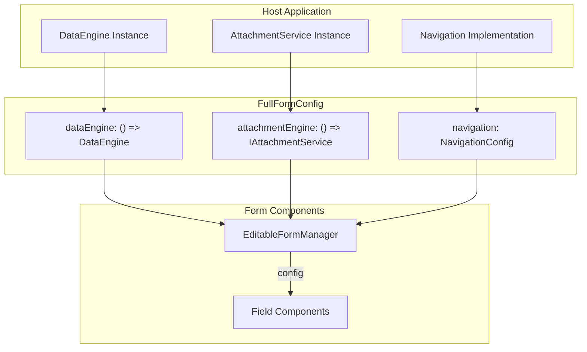
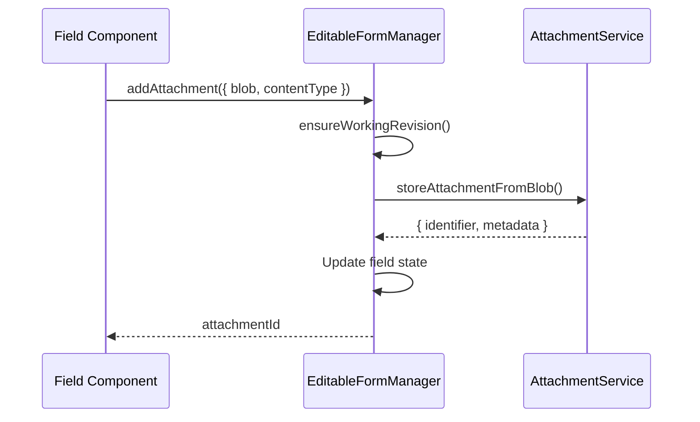

# Dependency Injection

## Overview

The form module uses **prop-based dependency injection** rather than React Context. Dependencies are passed as factory functions through the `FullFormConfig` interface.



## FullFormConfig Interface

```typescript
interface FullFormConfig extends BaseFormConfig {
  mode: 'full';
  recordId: string;
  
  // Factory functions for services
  dataEngine: () => DataEngine;
  attachmentEngine: () => IAttachmentService;
  
  // Update mode
  recordMode: AvpUpdateMode;
  
  // Navigation configuration
  navigation: NavigationConfig;
  
  // Context
  appName: string;
  user: string;
}
```

## DataEngine

Provides data persistence operations.

### Injection Pattern

```typescript
// Host provides factory function
const config: FullFormConfig = {
  dataEngine: () => myDataEngineInstance,
  // ...
};

// Consumer calls factory when needed
const dataEngine = useMemo(() => {
  return props.config.dataEngine();
}, [props.config.dataEngine]);
```

### Why Factory Functions?

Factory functions allow:
1. **Lazy instantiation** - Engine created only when needed
2. **Fresh references** - Handle database reconnections/updates
3. **Testing** - Easy to substitute mock implementations

### DataEngine Interface (Subset)

```typescript
interface DataEngine {
  uiSpec: ProjectUIModel;
  
  form: {
    createRecord(params): Promise<RecordResult>;
    createRevision(params): Promise<RevisionDocument>;
    updateFormData(params): Promise<void>;
    getExistingFormData(params): Promise<FormData>;
    getHydratedRecords(params): Promise<PaginatedRecords>;
  };
  
  hydrated: {
    getHydratedRecord(params): Promise<HydratedRecordDocument>;
    updateRevision(params): Promise<void>;
  };
}
```

### Usage in EditableFormManager

```typescript
// Record operations
await dataEngine.form.createRevision({
  recordId: props.recordId,
  revisionId: workingRevisionId,
  createdBy: props.activeUser,
});

// Data persistence
await dataEngine.form.updateFormData({
  recordId: props.recordId,
  revisionId: workingRevisionId,
  data: transformedData,
  type: 'updateOnly',
});
```

## AttachmentService

Handles file storage and retrieval.

### Injection Pattern

```typescript
const config: FullFormConfig = {
  attachmentEngine: () => myAttachmentService,
  // ...
};
```

### IAttachmentService Interface

```typescript
interface IAttachmentService {
  storeAttachmentFromBlob(params: {
    blob: Blob;
    metadata: AttachmentMetadata;
  }): Promise<AttachmentResult>;
  
  getAttachment(id: string): Promise<AttachmentDocument | null>;
}
```

### Usage Flow



### Attachment Handlers

EditableFormManager creates handlers that fields use:

```typescript
const handleAddAttachment = useCallback(async ({
  fieldId,
  blob,
  contentType,
  type,
  fileFormat,
}) => {
  const revisionToUse = await ensureWorkingRevision();
  
  const result = await props.config.attachmentEngine().storeAttachmentFromBlob({
    blob,
    metadata: {
      attachmentDetails: { filename, contentType },
      recordContext: { recordId, revisionId, created, createdBy },
    },
  });
  
  // Update form state with new attachment reference
  form.setFieldValue(fieldId, {
    ...currentValue,
    attachments: [newAttachment, ...existingAttachments],
  });
  
  return result.identifier.id;
}, [/* deps */]);
```

## Navigation

Handles routing between records.

### NavigationConfig Interface

```typescript
interface NavigationConfig {
  toRecord: (params: {
    recordId: string;
    mode: AvpUpdateMode;
    addNavigationEntry?: FormNavigationChildEntry;
    stripNavigationEntry?: number;
    scrollTarget?: RedirectInfo;
  }) => void;
  
  getToRecordLink: (params: {
    recordId: string;
    mode: AvpUpdateMode;
  }) => string;
  
  navigateToLink: (to: string) => void;
  
  navigateToRecordList: {
    label: string;
    navigate: () => void;
  };
  
  navigateToViewRecord: (params: { recordId: string }) => void;
}
```

### Usage Examples

```typescript
// Navigate to child record
props.config.navigation.toRecord({
  recordId: childRecordId,
  mode: 'new',
  addNavigationEntry: {
    fieldId: props.fieldId,
    parentMode: props.config.recordMode,
    recordId: props.config.recordId,
    relationType: 'parent',
  },
});

// Return to parent
props.config.navigation.toRecord({
  recordId: parentRecordId,
  mode: parentMode,
  stripNavigationEntry: 1,
  scrollTarget: { fieldId: originFieldId },
});

// Get link without navigating
const link = props.config.navigation.getToRecordLink({
  recordId,
  mode: 'parent',
});
```

## FormManagerAdditions

Additional handlers injected by EditableFormManager:

```typescript
interface FormManagerAdditions {
  navigationContext: FormNavigationContext;
  
  attachmentHandlers: {
    addAttachment: (params) => Promise<string>;
    removeAttachment: (params) => Promise<void>;
  };
  
  trigger: {
    commit: () => Promise<void>;
  };
}
```

### Trigger: Commit

Forces immediate save (bypasses debounce):

```typescript
// Used by RelatedRecordField before navigation
await props.trigger.commit();
props.config.navigation.toRecord({ ... });
```

## Preview Mode Fallbacks

In preview mode, dependencies are mocked:

```typescript
// Field.tsx mock handlers for preview
const addAttachmentHandler = props.config.mode === 'full'
  ? async (params) => {
      return await config.attachmentHandlers.addAttachment({ ...params, fieldId });
    }
  : async () => {
      console.log('Mock addAttachment');
      return 'fakeId';
    };

const triggers = props.config.mode === 'full'
  ? props.config.trigger
  : { commit: async () => console.log('Mock commit') };
```

## Testing

Replace dependencies with test implementations:

```typescript
const mockDataEngine: DataEngine = {
  uiSpec: testUISpec,
  form: {
    createRecord: vi.fn().mockResolvedValue({ record: { _id: 'test-id' } }),
    updateFormData: vi.fn().mockResolvedValue(undefined),
    // ...
  },
  // ...
};

const testConfig: FullFormConfig = {
  mode: 'full',
  dataEngine: () => mockDataEngine,
  attachmentEngine: () => mockAttachmentService,
  navigation: mockNavigation,
  // ...
};
```
