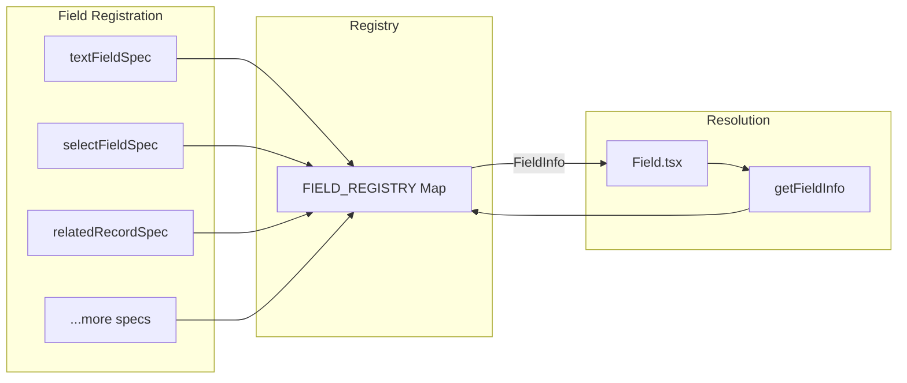

# Field System

## Overview

Fields are registered in a central registry and resolved at runtime by namespace and name.



## Field Registry

### Location

`lib/fieldRegistry/registry.ts`

### Structure

```typescript
const FieldSpecList: FieldInfo[] = [
  textFieldSpec,
  richTextFieldSpec,
  selectFieldSpec,
  takePhotoFieldSpec,
  fileUploaderFieldSpec,
  relatedRecordFieldSpec,
  templatedStringFieldSpec,
  multiSelectFieldSpec,
  advancedSelectFieldSpec,
  checkboxFieldSpec,
  radioGroupFieldSpec,
  takePointFieldSpec,
];

const FIELD_REGISTRY: Map<string, FieldInfo> = new Map();

// Build registry on module load
for (const spec of FieldSpecList) {
  const key = `${spec.namespace}::${spec.name}`;
  FIELD_REGISTRY.set(key, spec);
}
```

### Resolution

```typescript
export const getFieldInfo = ({
  namespace,
  name,
}: {
  namespace: string;
  name: string;
}): FieldInfo | undefined => {
  const key = `${namespace}::${name}`;
  return FIELD_REGISTRY.get(key);
};
```

## FieldInfo Interface

Every field must provide a `FieldInfo` object:

```typescript
interface FieldInfo<T extends FullFieldProps = FullFieldProps> {
  // Identity
  namespace: string;
  name: string;
  
  // Return type (for data model)
  returns: FieldReturnType | null;
  
  // Edit mode component
  component: React.ComponentType<T & Record<string, unknown>>;
  
  // View mode registration
  view: DataViewFieldRegistryEntry;
  
  // Validation schemas
  fieldPropsSchema?: z.ZodTypeAny;
  fieldDataSchemaFunction?: (props: any) => z.ZodTypeAny;
}
```

### Field Return Types

```typescript
type FieldReturnType =
  | 'faims-attachment::Files'
  | 'faims-core::Array'
  | 'faims-core::Bool'
  | 'faims-core::Date'
  | 'faims-core::Email'
  | 'faims-core::Integer'
  | 'faims-core::JSON'
  | 'faims-core::Number'
  | 'faims-core::Relationship'
  | 'faims-core::String'
  | 'faims-pos::Location';
```

## Adding a New Field

### Step 1: Create Field Directory

```
lib/fieldRegistry/fields/
└── MyField/
    ├── index.tsx      # Main export
    └── view.tsx       # View renderer (optional separate file)
```

### Step 2: Define Props Schema

```typescript
import { z } from 'zod';
import { BaseFieldPropsSchema } from '../../../formModule/types';

const myFieldPropsSchema = BaseFieldPropsSchema.extend({
  // Add field-specific props
  placeholder: z.string().optional(),
  maxLength: z.number().optional(),
  customOption: z.boolean().default(false),
});

type MyFieldProps = z.infer<typeof myFieldPropsSchema>;
type MyFieldFullProps = MyFieldProps & FormFieldContextProps;
```

### Step 3: Implement Edit Component

```typescript
import FieldWrapper from '../wrappers/FieldWrapper';

const MyField: React.FC<MyFieldFullProps> = (props) => {
  const {
    label,
    helperText,
    required,
    advancedHelperText,
    name,
    placeholder,
    maxLength,
    state,
    setFieldData,
    handleBlur,
    config,
  } = props;

  // Handle preview mode
  if (config.mode === 'preview') {
    return (
      <FieldWrapper heading={label} subheading={helperText}>
        <Typography>MyField Preview</Typography>
      </FieldWrapper>
    );
  }

  // Get current value
  const value = state.value?.data ?? '';
  const errors = state.meta.errors as unknown as string[];

  return (
    <FieldWrapper
      heading={label}
      subheading={helperText}
      required={required}
      advancedHelperText={advancedHelperText}
      errors={errors}
    >
      <TextField
        value={value}
        onChange={(e) => setFieldData(e.target.value)}
        onBlur={handleBlur}
        placeholder={placeholder}
        inputProps={{ maxLength }}
        fullWidth
      />
    </FieldWrapper>
  );
};
```

### Step 4: Implement View Component

```typescript
import { DataViewFieldRender } from '../../../rendering/types';

const MyFieldRenderer: DataViewFieldRender = (props) => {
  const { value } = props;
  
  if (!value) {
    return <EmptyResponsePlaceholder />;
  }
  
  return <Typography>{value}</Typography>;
};
```

### Step 5: Define Validation Schema Function

```typescript
const myFieldDataSchemaFunction = (props: MyFieldProps) => {
  let schema = z.string();
  
  if (props.required) {
    schema = schema.min(1, { message: 'This field is required' });
  }
  
  if (props.maxLength) {
    schema = schema.max(props.maxLength, {
      message: `Maximum ${props.maxLength} characters`,
    });
  }
  
  return schema;
};
```

### Step 6: Export FieldInfo

```typescript
export const myFieldSpec: FieldInfo<MyFieldFullProps> = {
  namespace: 'my-namespace',
  name: 'MyField',
  returns: 'faims-core::String',
  component: MyField,
  view: {
    component: MyFieldRenderer,
    config: {},
    attributes: { singleColumn: false },
  },
  fieldPropsSchema: myFieldPropsSchema,
  fieldDataSchemaFunction: myFieldDataSchemaFunction,
};
```

### Step 7: Register in Registry

```typescript
// registry.ts
import { myFieldSpec } from './fields/MyField';

const FieldSpecList: FieldInfo[] = [
  // ... existing fields
  myFieldSpec,
];
```

## Base Field Props

All fields inherit these props:

```typescript
const BaseFieldPropsSchema = z.object({
  label: z.string().optional(),
  name: z.string(),
  helperText: z.string().optional(),
  required: z.boolean().optional(),
  advancedHelperText: z.string().optional(),
  disabled: z.boolean().optional(),
});
```

## FormFieldContextProps

Injected by the form system:

```typescript
interface FormFieldContextProps {
  fieldId: string;
  state: FaimsFormFieldState;
  setFieldData: (value: any) => void;
  setFieldAnnotation: (value: FormAnnotation) => void;
  addAttachment: (params) => Promise<string>;
  removeAttachment: (params) => Promise<void>;
  handleBlur: () => void;
  config: FormConfig;
  trigger: { commit: () => Promise<void> };
}
```

## FieldWrapper Component

Standard wrapper providing consistent field UI:

```typescript
interface FieldWrapperProps {
  heading?: ReactNode;           // Field label
  subheading?: ReactNode;        // Helper text
  children: ReactNode;           // Field input
  required?: boolean;            // Show required indicator
  advancedHelperText?: ReactNode; // Extended help (dialog)
  errors?: string[];             // Validation errors
}
```

Features:
- Bold heading with optional required indicator (`*`)
- Helper text below heading
- Error display with red border and icon
- Advanced help button opens modal with markdown support

## Field State Structure

```typescript
interface FormDataEntry {
  data?: any;                    // Primary field value
  annotation?: FormAnnotation;   // User annotation
  attachments?: FaimsAttachments; // File attachments
}

// Access in component
const value = props.state.value?.data;
const annotation = props.state.value?.annotation;
const attachments = props.state.value?.attachments ?? [];
```
