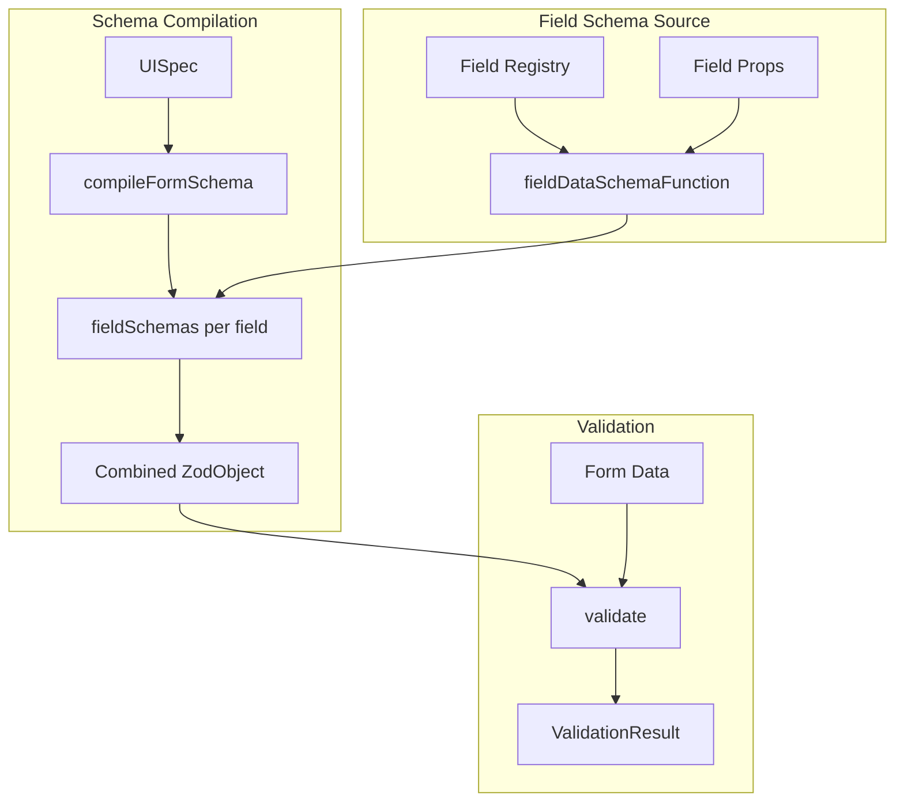
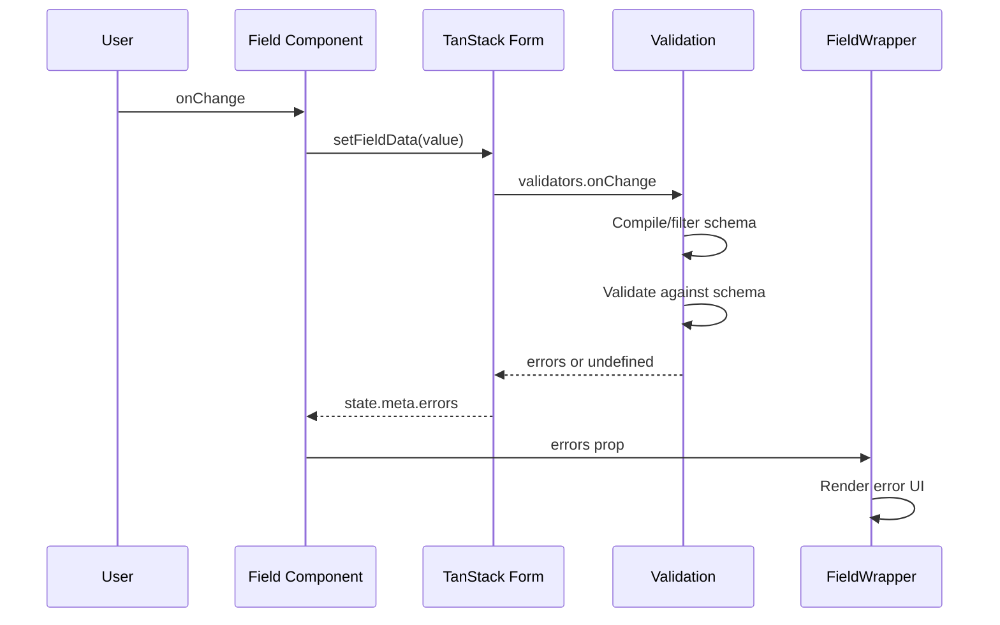

# Validation

## Overview

The validation module uses Zod schemas compiled from field specifications. It supports two strategies:

1. **Compiled Schema** - Pre-built schema for the entire form, efficient for repeated validation
2. **Per-Field Validation** - Individual field schemas, simpler but less efficient



## CompiledFormSchema

Pre-compiled schema for efficient validation:

```typescript
type CompiledFormSchema<T extends ZodRawShape = ZodRawShape> = {
  // Combined Zod schema
  schema: ZodObject<T>;
  // Individual field schemas
  fieldSchemas: Record<string, ZodTypeAny>;
  // Field IDs in schema
  fields: string[];
};
```

### Compilation

```typescript
const compiled = FormValidation.compileFormSchema({
  uiSpec: dataEngine.uiSpec,
  formId: 'site_form',
  config: {visibleBehaviour: 'include'},
});
```

### Configuration

```typescript
interface ValidationSettings {
  visibleBehaviour: 'include' | 'ignore';
}
```

| Setting   | Behaviour                                                      |
| --------- | -------------------------------------------------------------- |
| `include` | Validate all fields defined in form                            |
| `ignore`  | Validate only currently visible fields (requires `data` param) |

## Field Schema Generation

Each field provides a schema function:

```typescript
interface FieldInfo {
  fieldDataSchemaFunction?: (props: any) => z.ZodTypeAny;
}
```

The responsibility of this function is, given the uiSpec props for a field of that type, to return a Zod schema which validates a value for that field.

### Example: TextField

```typescript
const textFieldDataSchemaFunction = (props: TextFieldProps) => {
  let schema = z.string();

  if (props.required) {
    schema = schema.min(1, {message: 'This field is required'});
  }

  if (props.maxLength) {
    schema = schema.max(props.maxLength, {
      message: `Maximum ${props.maxLength} characters allowed`,
    });
  }

  return schema;
};
```

### Example: RelatedRecord

```typescript
const valueSchemaFunction = (props: RelatedRecordFieldProps) => {
  if (props.required) {
    return fieldValueSchema.refine(
      val => (Array.isArray(val) ? val.length > 0 : !!val),
      {message: 'At least one related record is required.'}
    );
  }
  return fieldValueSchema.optional().nullable();
};
```

### Example: FileUploader

```typescript
const fileUploaderSchemaFunction = (props: FileUploaderProps) => {
  let base = z.array(z.string());

  if (props.required) {
    base = base.refine(val => (val ?? []).length > 0, {
      message: 'At least one attachment is required',
    });
  }

  if (props.maximum_number_of_files > 0) {
    base = base.refine(val => val.length <= props.maximum_number_of_files, {
      message: `Maximum ${props.maximum_number_of_files} files allowed`,
    });
  }

  return base;
};
```

## Validation Modes

EditableFormManager uses different modes based on record state:

```typescript
type ValidationMode = 'FULL' | 'ONLY_TOUCHED';

const validationMode: ValidationMode =
  props.mode === 'new' ? 'ONLY_TOUCHED' : 'FULL';
```

| Mode           | Behaviour                                     | Use Case         |
| -------------- | --------------------------------------------- | ---------------- |
| `FULL`         | Validate all visible fields                   | Existing records |
| `ONLY_TOUCHED` | Validate only fields user has interacted with | New records      |

### Filtering for Touched Fields

```typescript
const filtered = FormValidation.filterCompiledSchema({
  compiledSchema: compiled,
  fieldIds: touchedFieldIds,
});
```

## Schema Recompilation

When field visibility changes, schemas can be incrementally updated:

```typescript
type RecompiledFormSchema = CompiledFormSchema & {
  addedFields: string[];
  removedFields: string[];
  reusedFields: string[];
};

const recompiled = FormValidation.recompileFormSchema({
  previousSchema: compiled,
  uiSpec,
  formId,
  data: currentValues,
  config,
});
```

## Validation Result

```typescript
interface ValidationResult {
  valid: boolean;
  errors: Record<string, string[]>;
  fieldResults: Record<string, FieldValidationResult>;
}

interface FieldValidationResult {
  valid: boolean;
  errors: string[];
}
```

## Integration with TanStack Form

Validation runs on form changes via TanStack Form's onChange:

```typescript
const form = useForm({
  defaultValues: initialData,
  validators: {
    onChange: ({value}) => {
      const result = FormValidation.validateFormData({
        schema: validationSchema.current,
        data: value,
        mode: validationMode,
        touchedFields: Array.from(touchedFields),
      });

      return result.valid ? undefined : result.errors;
    },
  },
});
```

## Error Display

Errors flow from validation to field components via state:

```typescript
// In field component
const errors = props.state.meta.errors as unknown as string[];

// FieldWrapper displays errors
<FieldWrapper heading={label} errors={errors}>
  {children}
</FieldWrapper>;
```

### FieldWrapper Error UI

- Red border with subtle glow
- Error icon with message
- Multiple errors shown as list

## Validation Timing



## FormValidation API

```typescript
const FormValidation = {
  compileFormSchema(params): CompiledFormSchema,

  filterCompiledSchema(params): CompiledFormSchema,

  recompileFormSchema(params): RecompiledFormSchema,

  getFieldSchema(params): ZodTypeAny | undefined,

  validateFormData(params): ValidationResult,

  validateField(params): FieldValidationResult,

  getRelevantFields(params): string[],
};
```

## Default Settings

```typescript
const DEFAULT_VALIDATION_SETTINGS: ValidationSettings = {
  visibleBehaviour: 'ignore',
};
```

With `'ignore'`, only currently visible fields are validated. This requires passing current form data to determine visibility.

## Props Schema Validation

Separate from data validation, field props can be validated against their schema:

```typescript
interface FieldInfo {
  fieldPropsSchema?: z.ZodTypeAny;
}

// Example
const textFieldPropsSchema = BaseFieldPropsSchema.extend({
  multiline: z.boolean().optional(),
  InputProps: z
    .object({
      type: z.string().optional(),
    })
    .optional(),
});
```

This validates UISpec field definitions at load time, catching configuration errors early.
