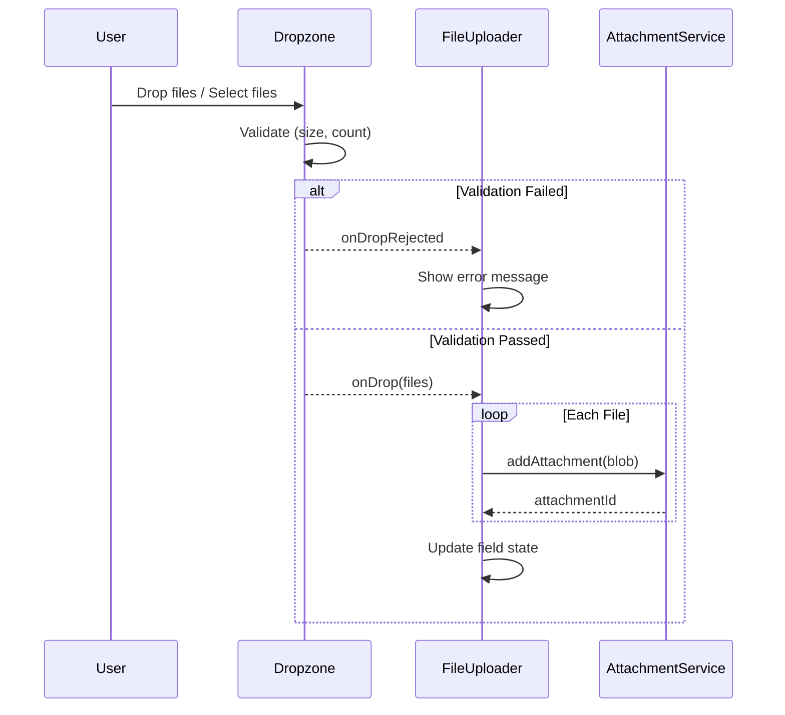

# FileUploader

## Overview

Drag-and-drop file upload field supporting multiple file types with size and count limits.

## Registration

```typescript
{
  namespace: 'faims-custom',
  name: 'FileUploader',
  returns: 'faims-attachment::Files',
}
```

## Component Parameters

| Parameter                 | Type      | Required | Default | Description                |
| ------------------------- | --------- | -------- | ------- | -------------------------- |
| `name`                    | `string`  | Yes      | -       | Field identifier           |
| `label`                   | `string`  | No       | -       | Display label              |
| `helperText`              | `string`  | No       | -       | Help text                  |
| `required`                | `boolean` | No       | `false` | At least one file required |
| `disabled`                | `boolean` | No       | `false` | Disable uploads            |
| `multiple`                | `boolean` | No       | `true`  | Allow multiple files       |
| `maximum_number_of_files` | `number`  | No       | `0`     | Max files (0 = unlimited)  |
| `maximum_file_size`       | `number`  | No       | -       | Max size in bytes          |
| `minimum_file_size`       | `number`  | No       | -       | Min size in bytes          |

### Props Schema

```typescript
const fileUploaderPropsSchema = BaseFieldPropsSchema.extend({
  multiple: z.boolean().optional().default(true),
  maximum_number_of_files: z.number().optional().default(0),
  maximum_file_size: z.number().optional(),
  minimum_file_size: z.number().optional(),
});
```

## Upload Flow



## Dropzone Integration

Uses `react-dropzone` for drag-and-drop:

```typescript
<Dropzone
  onDrop={handleDrop}
  onDropRejected={handleReject}
  disabled={disabled}
  multiple={multiple}
  maxFiles={maxFiles}
  maxSize={maximumFileSize}
  minSize={minimumFileSize}
>
  {({getRootProps, getInputProps, isDragActive}) => (
    <Paper {...getRootProps()}>
      <input {...getInputProps()} />
      {/* Drop zone UI */}
    </Paper>
  )}
</Dropzone>
```

## File Handling

### Upload Handler

```typescript
const handleDrop = useCallback(
  async (acceptedFiles: File[]) => {
    // Check file count limit
    const currentCount = state.value?.attachments?.length || 0;
    if (
      maximumNumberOfFiles > 0 &&
      currentCount + acceptedFiles.length > maximumNumberOfFiles
    ) {
      setError(`Maximum ${maximumNumberOfFiles} files allowed`);
      return;
    }

    // Upload each file
    for (const file of acceptedFiles) {
      await addAttachment({
        blob: file,
        contentType: file.type || 'application/octet-stream',
        fileFormat: file.name.split('.').pop() || 'txt',
        type: 'file',
      });
    }
  },
  [
    /* deps */
  ]
);
```

### Rejection Handler

```typescript
const handleReject = useCallback(
  (rejections: FileRejection[]) => {
    const errorCode = rejections[0]?.errors[0]?.code;

    switch (errorCode) {
      case 'file-too-large':
        setError(`File too large. Max: ${formatFileSize(maxSize)}`);
        break;
      case 'file-too-small':
        setError(`File too small. Min: ${formatFileSize(minSize)}`);
        break;
      case 'too-many-files':
        setError('Too many files selected');
        break;
    }
  },
  [maxSize, minSize]
);
```

## File Display

### File Type Detection

```typescript
function isImageFile(contentType: string): boolean {
  return contentType.startsWith('image/');
}

function getFileIcon(contentType: string) {
  if (isImageFile(contentType)) {
    return <ImageIcon />;
  }
  return <InsertDriveFileIcon />;
}
```

### File Size Formatting

```typescript
function formatFileSize(bytes: number): string {
  if (bytes === 0) return '0 Bytes';
  const k = 1024;
  const sizes = ['Bytes', 'KB', 'MB', 'GB'];
  const i = Math.floor(Math.log(bytes) / Math.log(k));
  return Math.round((bytes / Math.pow(k, i)) * 100) / 100 + ' ' + sizes[i];
}
```

## UI Components

### Edit Mode States

| State       | Display                                    |
| ----------- | ------------------------------------------ |
| Empty       | Dropzone with upload icon and instructions |
| Has Files   | File list with thumbnails/icons            |
| Drag Active | Highlighted dropzone                       |
| Loading     | File entry with spinner                    |
| Error       | Error message banner                       |
| Offline     | "Not synced" indicator                     |

### File List Item

Each uploaded file shows:

- Icon (image thumbnail or file type icon)
- Filename
- File size (if available)
- View button (opens dialog)
- Delete button

### Preview Dialog

For images: Full-size preview
For other files: Download prompt

## View Mode

Currently uses default renderer:

```typescript
view: {
  component: DefaultRenderer,
  config: {},
}
```

## Validation

```typescript
const fileUploaderSchemaFunction = (props: FileUploaderProps) => {
  let base = z.array(z.string());

  if (props.required) {
    base = base.refine(val => (val ?? []).length > 0, {
      message: 'At least one attachment is required',
    });
  }

  if (props.maximum_number_of_files > 0) {
    base = base.refine(val => val.length <= props.maximum_number_of_files, {
      message: `Maximum ${props.maximum_number_of_files} files allowed`,
    });
  }

  return base;
};
```

## Example UISpec

```json
{
  "component-namespace": "faims-custom",
  "component-name": "FileUploader",
  "component-parameters": {
    "name": "survey_documents",
    "label": "Supporting Documents",
    "helperText": "Upload PDF reports, spreadsheets, or images",
    "multiple": true,
    "maximum_number_of_files": 10,
    "maximum_file_size": 10485760,
    "required": false
  },
  "initialValue": null,
  "persistent": true,
  "displayParent": false,
  "meta": {
    "annotation": {"include": true, "label": "Document notes"},
    "uncertainty": {"include": false, "label": ""}
  }
}
```

## Field Value Structure

```typescript
{
  data: string[],           // Array of attachment IDs
  attachments: [
    {
      attachmentId: 'att-456',
      filename: 'report.pdf',
      fileType: 'application/pdf',
    }
  ],
  annotation?: FormAnnotation,
}
```

## Error Messages

| Condition      | Message                                       |
| -------------- | --------------------------------------------- |
| File too large | "File is too large. Maximum size: {size}"     |
| File too small | "File is too small. Minimum size: {size}"     |
| Too many files | "Maximum {n} files allowed"                   |
| Upload failed  | "Failed to upload file(s). Please try again." |

## Dependencies

| Package          | Purpose                      |
| ---------------- | ---------------------------- |
| `react-dropzone` | Drag-and-drop file selection |
| `@mui/material`  | UI components                |

## Offline Handling

Files that haven't been synced show warning:

```typescript
{
  loadedFiles.some(f => f.isError) && (
    <Alert severity="warning">
      Some files could not be loaded. Enable attachment download in Settings.
    </Alert>
  );
}
```
