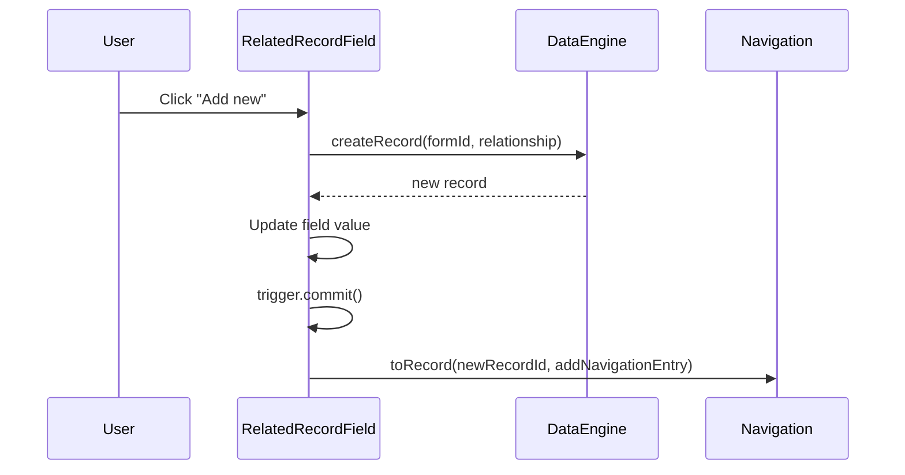
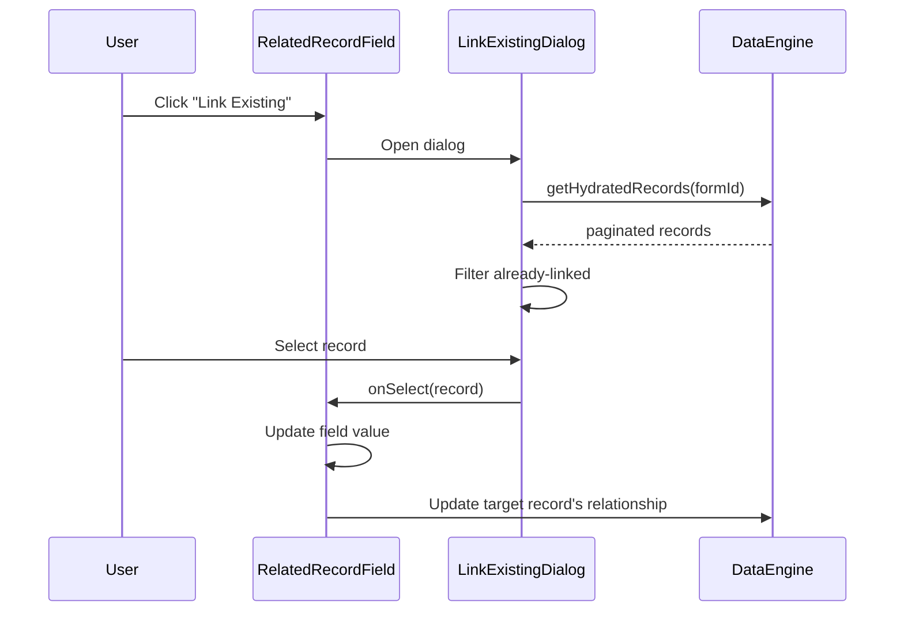
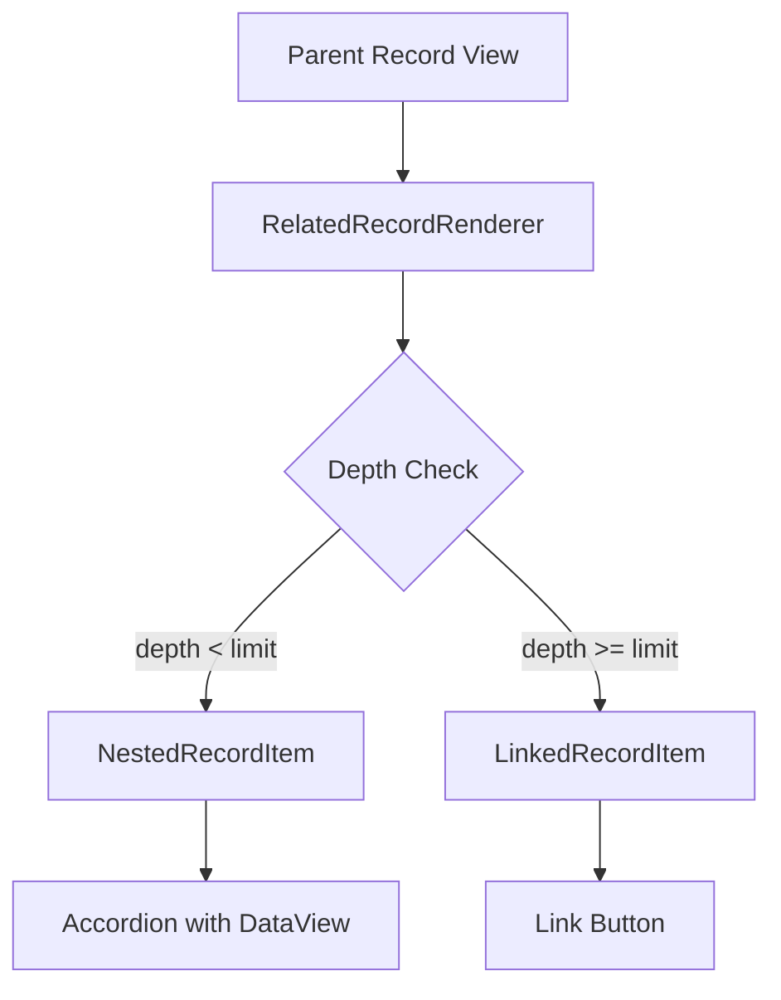

# RelatedRecordSelector

## Overview

Links records together via parent-child or linked relationships. Supports creating new related records and linking to existing ones.

## Registration

```typescript
{
  namespace: 'faims-custom',
  name: 'RelatedRecordSelector',
  returns: 'faims-core::Relationship',
}
```

## Component Parameters

| Parameter             | Type      | Required | Default | Description                                     |
| --------------------- | --------- | -------- | ------- | ----------------------------------------------- |
| `name`                | `string`  | Yes      | -       | Field identifier                                |
| `label`               | `string`  | No       | -       | Display label                                   |
| `helperText`          | `string`  | No       | -       | Help text                                       |
| `related_type`        | `string`  | Yes      | -       | Target form ID (viewset)                        |
| `relation_type`       | `enum`    | Yes      | -       | `'faims-core::Child'` or `'faims-core::Linked'` |
| `multiple`            | `boolean` | No       | `false` | Allow multiple links                            |
| `allowLinkToExisting` | `boolean` | No       | `false` | Show "Link Existing" button                     |

### Props Schema

```typescript
const relatedRecordPropsSchema = BaseFieldPropsSchema.extend({
  related_type: z.string(),
  relation_type: z.enum(['faims-core::Child', 'faims-core::Linked']),
  multiple: z.boolean().optional().default(false),
  allowLinkToExisting: z.boolean().optional().default(false),
});
```

## Relation Types

| Type                 | Forward Relation | Reverse Relation | Use Case                  |
| -------------------- | ---------------- | ---------------- | ------------------------- |
| `faims-core::Child`  | "has child"      | "is child of"    | Hierarchical parent-child |
| `faims-core::Linked` | "is linked to"   | "is linked from" | Peer associations         |

```typescript
function relationTypeToPair(type): [string, string] {
  if (type === 'faims-core::Child') {
    return ['has child', 'is child of'];
  } else {
    return ['is linked to', 'is linked from'];
  }
}
```

## Field Value Structure

```typescript
const fieldValueEntrySchema = z.object({
  record_id: z.string(),
  project_id: z.string().optional(),
  relation_type_vocabPair: z.tuple([z.string(), z.string()]),
});

// Single or array
type FieldValue = FieldValueEntry | FieldValueEntry[];
```

Example stored value:

```json
[
  {
    "record_id": "artifact-001",
    "relation_type_vocabPair": ["has child", "is child of"]
  },
  {
    "record_id": "artifact-002",
    "relation_type_vocabPair": ["has child", "is child of"]
  }
]
```

## Edit Mode Features

### Add New Record



### Link Existing Record

When `allowLinkToExisting` is true:



### Navigation Entry

When navigating to a related record, a navigation entry is added:

```typescript
props.config.navigation.toRecord({
  recordId: res.record._id,
  mode: 'new',
  addNavigationEntry: {
    fieldId: props.fieldId,
    parentMode: props.config.recordMode,
    recordId: props.config.recordId,
    relationType:
      props.relation_type === 'faims-core::Child' ? 'parent' : 'linked',
  },
});
```

This enables the "Return to parent" navigation.

## View Mode Features

### Nested Rendering

Related records can be expanded inline up to `RENDER_NEST_LIMIT` (default: 2):



### Cycle Detection

Prevents infinite loops when records reference each other:

```typescript
const ancestorIds = useMemo(() => {
  const ids = new Set(trace.map(t => t.recordId));
  if (record._id) ids.add(record._id);
  return ids;
}, [trace, record._id]);

const isCycle = ancestorIds.has(record_id);
const shouldFetch = !isCycle && !isDepthLimitReached;
```

### Value Normalisation

```typescript
function normalizeRecordReferences(value: unknown): RecordReference[] | null {
  const parseResult = RecordReferenceInputSchema.safeParse(value);
  if (!parseResult.success) return null;

  const parsed = parseResult.data;
  return Array.isArray(parsed) ? parsed : [parsed];
}
```

## UI Components

### Edit Mode

- **Add Button**: Creates new record of `related_type`
- **Link Button**: Opens selection dialog (if `allowLinkToExisting`)
- **Record List**: Shows linked records with HRID, click to navigate

### View Mode

- **Nested (depth < limit)**: Accordion with full record view inside
- **Linked (depth >= limit)**: Simple link card with "View Record" button
- **Loading**: Skeleton placeholders
- **Error**: Error message with record ID fallback

## Validation

```typescript
const valueSchemaFunction = (props: RelatedRecordFieldProps) => {
  if (props.required) {
    return fieldValueSchema.refine(
      val => {
        if (Array.isArray(val)) return val.length > 0;
        return !!val;
      },
      {message: 'At least one related record is required.'}
    );
  }
  return fieldValueSchema.optional().nullable();
};
```

## Example UISpec

```json
"Site-Buildings": {
    "component-namespace": "faims-custom",
    "component-name": "RelatedRecordSelector",
    "type-returned": "faims-core::Relationship",
    "component-parameters": {
        "label": "Building",
        "fullWidth": true,
        "helperText": "Add a building to the site.",
        "required": false,
        "related_type": "Building",
        "relation_type": "faims-core::Child",
        "allowLinkToExisting": true,
        "multiple": true,
        "related_type_label": "Building",
        "name": "Site-Buildings",
        "relation_linked_vocabPair": [],
        "protection": "none"
    },
    "validationSchema": [
        [
            "yup.string"
        ]
    ],
    "initialValue": "",
    "meta": {
        "annotation": {
            "include": false,
            "label": "annotation"
        },
        "uncertainty": {
            "include": false,
            "label": "uncertainty"
        }
    },
    "persistent": false,
    "displayParent": false
}
```

## Relationship Storage

Relationships are stored bidirectionally:

### On Source Record (this field)

```json
{
  "excavation_units": {
    "data": [
      {
        "record_id": "unit-001",
        "relation_type_vocabPair": ["has child", "is child of"]
      }
    ]
  }
}
```

### On Target Record (revision.relationship)

```typescript
{
  relationship: {
    parent: [
      {
        fieldId: 'excavation_units',
        recordId: 'trench-001',
        relationTypeVocabPair: ['has child', 'is child of'],
      },
    ];
  }
}
```
