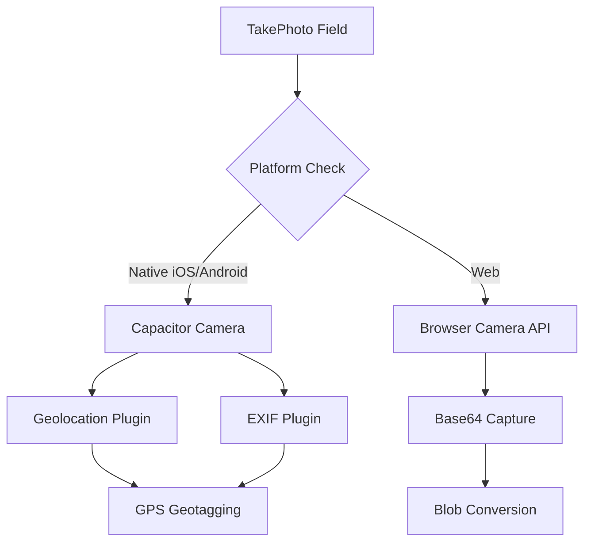
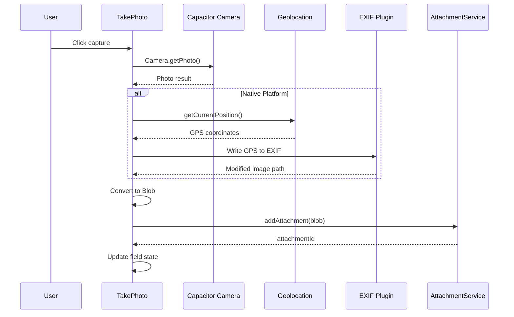

# TakePhoto

## Overview

Camera capture field using Capacitor Camera API. Supports both native mobile and web platforms with GPS geotagging.

## Registration

```typescript
{
  namespace: 'faims-custom',
  name: 'TakePhoto',
  returns: 'faims-attachment::Files',
}
```

## Component Parameters

| Parameter | Type | Required | Default | Description |
|-----------|------|----------|---------|-------------|
| `name` | `string` | Yes | - | Field identifier |
| `label` | `string` | No | - | Display label |
| `helperText` | `string` | No | - | Help text |
| `required` | `boolean` | No | `false` | At least one photo required |
| `disabled` | `boolean` | No | `false` | Disable capture |

### Props Schema

```typescript
const takePhotoPropsSchema = BaseFieldPropsSchema.extend({});
```

No additional parameters beyond base field props.

## Platform Support



### Native (iOS/Android)

- Uses `@capacitor/camera` plugin
- Automatic EXIF metadata with GPS coordinates
- High-quality image capture
- Gallery selection supported

### Web

- Uses `@capacitor/camera` with web fallback
- Base64 image conversion to Blob
- Limited EXIF support

## Capture Flow



## Photo Storage

Photos are stored as attachments with metadata:

```typescript
await addAttachment({
  blob: photoBlob,
  contentType: `image/${format}`,
  type: 'photo',
  fileFormat: format, // 'jpeg', 'png', etc.
});
```

### Attachment Metadata

```typescript
{
  attachmentDetails: {
    filename: 'photo_2024-01-15T10:30:00.000Z.jpeg',
    contentType: 'image/jpeg',
  },
  recordContext: {
    recordId: 'record-123',
    revisionId: 'rev-456',
    created: '2024-01-15T10:30:00.000Z',
    createdBy: 'user@example.com',
  }
}
```

## GPS Geotagging

On native platforms, GPS coordinates are embedded in EXIF metadata:

```typescript
// Get current location
const position = await Geolocation.getCurrentPosition({
  enableHighAccuracy: true,
});

// Write to EXIF
await Exif.setCoordinates({
  path: image.path,
  latitude: position.coords.latitude,
  longitude: position.coords.longitude,
});
```

## Edit Mode UI

### States

| State | Display |
|-------|---------|
| Empty | Placeholder with "Take First Photo" button |
| Has Photos | Grid of thumbnails with add/delete buttons |
| Loading | Thumbnail skeleton |
| Offline | "Not synced" placeholder for unloaded photos |

### Actions

- **Take Photo**: Opens camera
- **Choose from Gallery**: Opens photo picker (native only)
- **Delete**: Removes photo with confirmation dialog
- **View**: Full-screen image preview

## View Mode UI

Displays captured photos in a flex grid:

```typescript
const TakePhotoRender: DataViewFieldRender = (props) => {
  const attachments = useAttachments(
    (props.attachments ?? []).map(a => a.attachmentId),
    attachmentService
  );
  
  return (
    <Box sx={{ display: 'flex', flexWrap: 'wrap', gap: 2 }}>
      {displayableImages.map((img, idx) => (
        
      ))}
    </Box>
  );
};
```

### Offline Handling

Photos not yet synced show placeholder:

```typescript
{Array.from({ length: notDownloadedCount }).map((_, idx) => (
  <Paper sx={{ width: 300, height: 300 }}>
    <CloudOffIcon />
    <Typography>Attachment not synced</Typography>
  </Paper>
))}
```

## Permissions

### Camera Permission

Handled by Capacitor. If denied, shows alert:

```typescript
<CameraPermissionIssue />
```

### Location Permission

Required for geotagging. Gracefully degrades if denied (photos still captured, just without GPS).

## Supported Image Types

```typescript
const imageTypes = [
  'image/png',
  'image/jpeg',
  'image/jpg',
  'image/webp',
  'image/gif',
];
```

## Validation

```typescript
const takePhotoDataSchemaFunction = (props: TakePhotoProps) => {
  if (props.required) {
    return z.array(z.string()).min(1, {
      message: 'At least one photo is required',
    });
  }
  return z.array(z.string()).optional();
};
```

## Example UISpec

```json
{
  "component-namespace": "faims-custom",
  "component-name": "TakePhoto",
  "component-parameters": {
    "name": "site_photos",
    "label": "Site Documentation",
    "helperText": "Capture photos of the excavation site",
    "required": true
  },
  "initialValue": null,
  "persistent": true,
  "displayParent": true,
  "meta": {
    "annotation": {
      "include": true,
      "label": "Photo notes"
    },
    "uncertainty": {
      "include": false,
      "label": ""
    }
  }
}
```

## Dependencies

| Package | Purpose |
|---------|---------|
| `@capacitor/camera` | Camera access |
| `@capacitor/geolocation` | GPS coordinates |
| `@capacitor-community/exif` | EXIF metadata writing |
| `buffer` | Base64 conversion |

## Field Value Structure

```typescript
// State structure
{
  data: string[],           // Array of attachment IDs
  attachments: [            // Attachment metadata
    {
      attachmentId: 'att-123',
      filename: 'photo_2024-01-15.jpeg',
      fileType: 'image/jpeg',
    }
  ],
  annotation?: FormAnnotation,
}
```

## Error Handling

| Error | Handling |
|-------|----------|
| Camera permission denied | Show permission alert |
| Geolocation failed | Continue without GPS |
| Storage full | Show error message |
| Upload failed | Show retry option |
