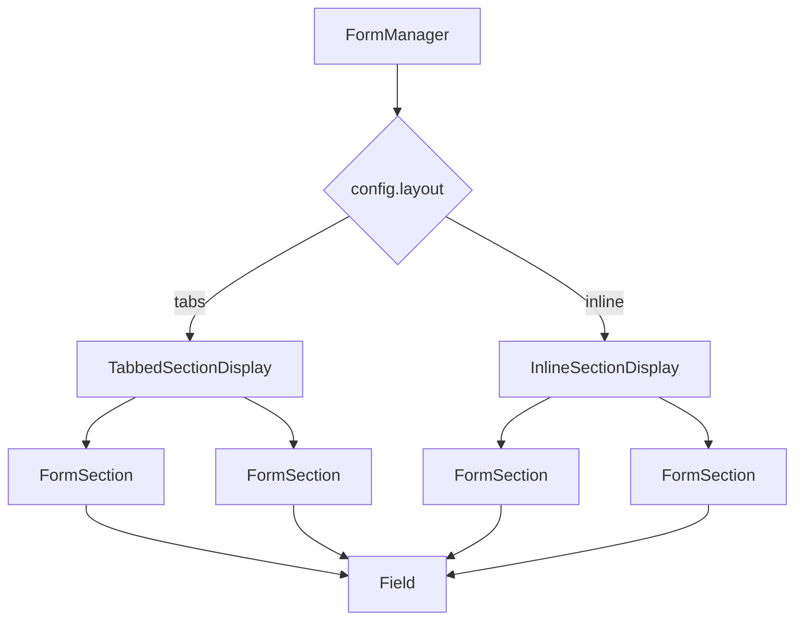

# Sections

## Overview

Sections group related fields within a form. Two layout modes are supported:

| Layout   | Component              | Behaviour                                             |
| -------- | ---------------------- | ----------------------------------------------------- |
| `tabs`   | `TabbedSectionDisplay` | One section visible at a time, tab/stepper navigation |
| `inline` | `InlineSectionDisplay` | All sections visible, vertical stack                  |



## UISpec Section Definition

Sections are defined in `views` and referenced by `viewsets` (interchangeably referred to as 'forms'):

```json
{
  "views": {
    "basic_info": {
      "label": "Basic Information",
      "fields": ["site_name", "site_type", "location"]
    },
    "media": {
      "label": "Media",
      "fields": ["photos", "documents"]
    },
    "relationships": {
      "label": "Related Records",
      "fields": ["parent_site", "artifacts"]
    }
  },
  "viewsets": {
    "site_form": {
      "label": "Site Record",
      "views": ["basic_info", "media", "relationships"]
    }
  }
}
```

## TabbedSectionDisplay

### Features

- Tab bar for desktop, stepper for mobile
- Error badges on tabs with validation errors
- Automatic scroll to field on error click
- Responsive width detection

### Responsive Behaviour

```typescript
const MIN_STEP_WIDTH_PX = 120;

// Switch to mobile stepper when tabs don't fit
const useMobileStepper = containerWidth / sections.length < MIN_STEP_WIDTH_PX;
```

### Desktop: Tab Bar

```typescript
<Tabs value={activeTab} onChange={handleTabChange}>
  {sections.map((sectionId, index) => (
    <Tab
      label={
        <Badge badgeContent={errorCount} color="error">
          {getSectionLabel(uiSpec, sectionId)}
        </Badge>
      }
    />
  ))}
</Tabs>
```

### Mobile: Stepper

```typescript
<MobileStepper
  steps={sections.length}
  activeStep={activeTab}
  nextButton={<Button onClick={handleNext}>Next</Button>}
  backButton={<Button onClick={handleBack}>Back</Button>}
/>
```

### Error Summary Panel

When validation errors exist, shows clickable error list:

```typescript
<Paper sx={{bgcolor: 'error.light'}}>
  <Typography>Please fix the following errors:</Typography>
  {Object.entries(errorsBySection).map(([sectionId, fields]) => (
    <div key={sectionId}>
      <Typography>{getSectionLabel(sectionId)}</Typography>
      <ul>
        {fields.map(fieldId => (
          <li>
            <Link onClick={() => scrollToFieldInSection(sectionId, fieldId)}>
              {getFieldLabel(fieldId)}: {errors[fieldId].join(', ')}
            </Link>
          </li>
        ))}
      </ul>
    </div>
  ))}
</Paper>
```

### Scroll to Field

```typescript
const scrollToField = (fieldId: string): boolean => {
  const elementId = getFieldId({fieldId});
  const element = document.getElementById(elementId);

  if (element) {
    element.scrollIntoView({behavior: 'smooth', block: 'center'});
    return true;
  }
  return false;
};

// Combined with tab switch
const scrollToFieldInSection = (sectionId, fieldId) => {
  const sectionIndex = sections.indexOf(sectionId);
  setActiveTab(sectionIndex);

  // Wait for render then scroll
  setTimeout(() => scrollToField(fieldId), 100);
};
```

## InlineSectionDisplay

### Features

- All sections rendered vertically
- Optional section headers
- Simpler than tabbed (no navigation state)

### Structure

```typescript
<Stack spacing={3}>
  {sections.map(sectionId => (
    <div key={sectionId}>
      <Typography variant="h5">{getSectionLabel(sectionId)}</Typography>
      <FormSection
        sectionId={sectionId}
        form={form}
        spec={uiSpec}
        config={config}
        visibleFields={fieldVisibilityMap?.[sectionId]}
      />
    </div>
  ))}
</Stack>
```

## FormSection

Renders individual fields within a section.

### Props

| Prop            | Type                | Description            |
| --------------- | ------------------- | ---------------------- |
| `sectionId`     | `string`            | View ID from UISpec    |
| `form`          | `FaimsForm`         | TanStack Form instance |
| `spec`          | `UISpecification`   | UI specification       |
| `config`        | `FormManagerConfig` | Mode and handlers      |
| `visibleFields` | `string[]`          | Field IDs to render    |

### Rendering Logic

```typescript
const FormSection: React.FC<FormSectionProps> = props => {
  // Get fields for this section
  const sectionFields = getFieldsForView(props.spec, props.sectionId);

  // Filter by visibility
  const fieldsToRender = props.visibleFields
    ? sectionFields.filter(f => props.visibleFields.includes(f))
    : sectionFields;

  return (
    <div>
      {fieldsToRender.map(fieldId => (
        <Field
          key={fieldId}
          fieldId={fieldId}
          fieldSpec={props.spec.fields[fieldId]}
          form={props.form}
          config={props.config}
        />
      ))}
    </div>
  );
};
```

## Field Visibility

Visibility is computed from form values and UISpec rules:

```typescript
const visibleMap = currentlyVisibleMap({
  values: formDataExtractor({ fullData: formData }),
  uiSpec: dataEngine.uiSpec,
  viewsetId: formId,
});

// Result: Record<sectionId, fieldId[]>
{
  "basic_info": ["site_name", "site_type"],
  "media": ["photos"]  // "documents" hidden by condition
}
```

### Visibility Map Type

```typescript
type FieldVisibilityMap = Record<string, string[]>;
// Maps section ID to list of visible field IDs within that section
```

## Scroll Target (Navigation)

When navigating back from a child record, scroll to the originating field:

```typescript
interface RedirectInfo {
  fieldId: string;
}

// In navigation context
const context: FormNavigationContext = {
  mode: 'child',
  lineage: [...],
  scrollTarget: { fieldId: 'artifacts' }
};

// On mount, scroll to target
useEffect(() => {
  if (navigationContext.scrollTarget) {
    scrollToField(navigationContext.scrollTarget.fieldId);
  }
}, []);
```

## DataView Sections

View mode uses accordion-based sections:

```typescript
const DataViewSection: React.FC<DataViewSectionProps> = (props) => {
  return (
    <Accordion defaultExpanded>
      <AccordionSummary expandIcon={<ExpandMoreIcon />}>
        <Typography>{props.sectionLabel}</Typography>
      </AccordionSummary>
      <AccordionDetails>
        <Grid container spacing={2}>
          {props.fields.map(field => (
            <Grid item xs={12} md={field.singleColumn ? 12 : 6}>
              <DataViewField ... />
            </Grid>
          ))}
        </Grid>
      </AccordionDetails>
    </Accordion>
  );
};
```

## Hidden Sections

Sections with no visible fields are not rendered:

```typescript
// TabbedSectionDisplay
const visibleSections = sections.filter(sectionId => {
  const sectionFields = fieldVisibilityMap?.[sectionId];
  return sectionFields && sectionFields.length > 0;
});

// DataView
const hasVisibleContent = sectionFields.some(field => {
  const isHidden = uiSpec.fields[field.name]?.['component-parameters']?.hidden;
  return !isHidden;
});

if (!hasVisibleContent) return null;
```

## Error Grouping

Errors are grouped by section for display:

```typescript
const groupErrorsBySection = (
  errors: Record<string, string[]>,
  sections: string[],
  uiSpec: UISpecification
): Record<string, string[]> => {
  const result: Record<string, string[]> = {};

  for (const sectionId of sections) {
    const sectionFields = getFieldsForView(uiSpec, sectionId);
    const sectionErrorFields = Object.keys(errors).filter(fieldName =>
      sectionFields.includes(fieldName)
    );

    if (sectionErrorFields.length > 0) {
      result[sectionId] = sectionErrorFields;
    }
  }

  return result;
};
```

## Section Labels

Retrieved from UISpec:

```typescript
const getSectionLabel = (
  uiSpec: UISpecification,
  sectionId: string
): string => {
  return uiSpec.views[sectionId]?.label ?? sectionId;
};
```
