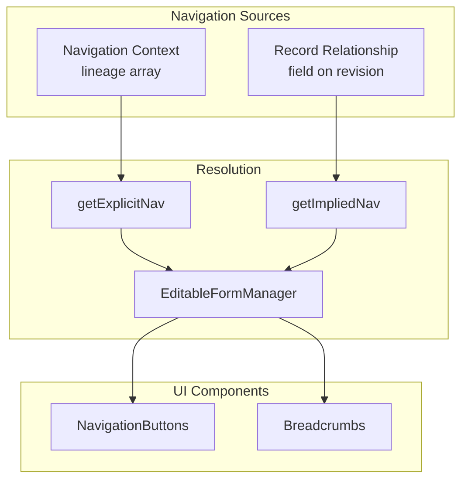
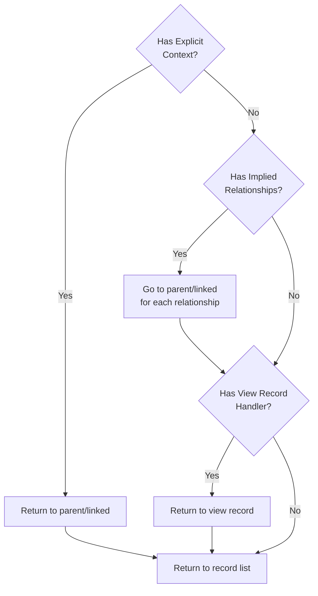
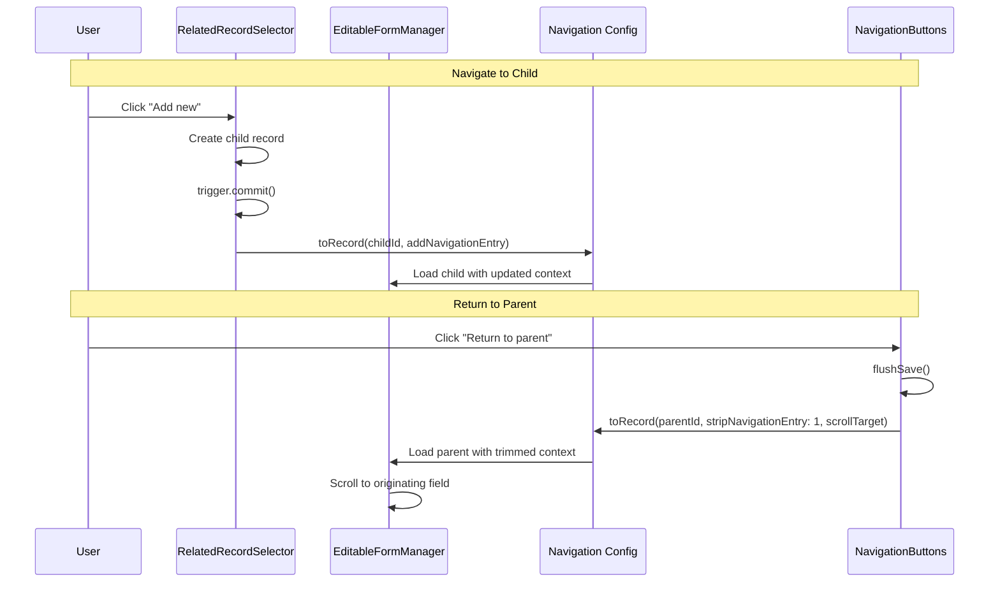

# Form Navigation

## Overview

The form module supports hierarchical record navigation with parent-child and linked relationships. Navigation context is maintained as users traverse between related records, enabling "return to parent" functionality and breadcrumb trails.

Two navigation modes exist:

| Mode         | Source                       | Use Case                                       |
| ------------ | ---------------------------- | ---------------------------------------------- |
| **Explicit** | Navigation context (lineage) | User navigated via RelatedRecordSelector       |
| **Implied**  | Record's relationship field  | User arrived directly (URL, search, deep link) |



## Navigation Context

Tracks the path a user took to reach the current record.

### Schema

```typescript
type FormNavigationContext =
  | FormNavigationContextRoot
  | FormNavigationContextChild;

interface FormNavigationContextRoot {
  mode: 'root';
  scrollTarget?: RedirectInfo;
}

interface FormNavigationContextChild {
  mode: 'child';
  lineage: FormNavigationChildEntry[];
  scrollTarget?: RedirectInfo;
}
```

### Lineage Entry

Each entry represents a parent record in the navigation path:

```typescript
interface FormNavigationChildEntry {
  recordId: string;
  revisionId?: string;
  parentMode: 'parent' | 'new'; // How parent was being edited
  relationType: 'parent' | 'linked'; // Relationship type
  fieldId: string; // Field that initiated navigation
}
```

### Example Lineage

User navigates: Site → Trench → Excavation Unit

```typescript
{
  mode: 'child',
  lineage: [
    {
      recordId: 'site-001',
      parentMode: 'parent',
      relationType: 'parent',
      fieldId: 'trenches'
    },
    {
      recordId: 'trench-001',
      parentMode: 'new',
      relationType: 'parent',
      fieldId: 'excavation_units'
    }
  ]
}
```

## Explicit Navigation

Derived from the navigation context's lineage array. Available when user navigated through RelatedRecordSelector fields.

### Building Explicit Navigation

```typescript
const getExplicitNav = async () => {
  if (navigationContext.mode === 'root') {
    return null;
  }

  const lineage = navigationContext.lineage;
  const latestLineage = lineage[lineage.length - 1];

  // Hydrate parent record to get HRID
  const hydrated = await engine.hydrated.getHydratedRecord({
    recordId: latestLineage.recordId,
    revisionId: latestLineage.revisionId,
  });

  return {
    parentNavButton: {
      link: getToRecordLink({recordId, mode}),
      mode: latestLineage.parentMode,
      recordId: latestLineage.recordId,
      label: `Return to ${hydrated.hrid}`,
      fieldId: latestLineage.fieldId,
      formId: hydrated.record.formId,
      relationType: latestLineage.relationType,
    },
    hydratedRecord: hydrated,
    fullContext: navigationContext,
  };
};
```

### ParentNavInfo

```typescript
interface ParentNavInfo {
  link: string; // URL to parent record
  mode: AvpUpdateMode; // 'parent' | 'new'
  recordId: string;
  label: string; // "Return to {HRID}"
  fieldId: string; // For scroll targeting
  formId: string; // Parent's form type
  relationType: 'parent' | 'linked';
}
```

## Implied Navigation

Derived from the record's `relationship` field. Used as fallback when no explicit navigation context exists.

### When Implied Navigation Applies

- User opened record via direct URL
- User found record via search
- User opened record from record list
- Deep link from external source

### Building Implied Navigation

```typescript
async function getImpliedNavigationRelationships(
  revision: HydratedRevisionDocument,
  engine: DataEngine,
  uiSpec: UISpecification
): Promise<ImpliedRelationship[]> {
  const results: ImpliedRelationship[] = [];

  // Process parent relationships
  if (revision.relationship?.parent?.length > 0) {
    for (const rel of revision.relationship.parent) {
      const hydrated = await engine.hydrated.getHydratedRecord({
        recordId: rel.recordId,
      });

      results.push({
        type: 'parent',
        recordId: hydrated.record._id,
        fieldId: rel.fieldId,
        hrid: hydrated.hrid,
        formId: hydrated.record.formId,
        formLabel: uiSpec.viewsets[hydrated.record.formId]?.label,
      });
    }
  }

  // Process linked relationships
  if (revision.relationship?.linked?.length > 0) {
    // Similar processing for linked records...
  }

  return results;
}
```

### ImpliedParentNavInfo

```typescript
interface ImpliedParentNavInfo {
  type: 'parent' | 'linked';
  recordId: string;
  fieldId: string;
  formId: string;
  label: string; // HRID of related record
  onNavigate: () => void; // Navigation handler
}
```

## Navigation Priority

NavigationButtons displays options in priority order:



### Button Labels

| Context         | Label                             |
| --------------- | --------------------------------- |
| Explicit parent | "Return to parent ({FormLabel})"  |
| Explicit linked | "Return to related ({FormLabel})" |
| Implied parent  | "Go to parent ({FormId})"         |
| Implied linked  | "Go to linked record ({FormId})"  |
| View mode       | "Return to view record"           |
| Always          | "{Record List Label}"             |

## Navigation Callbacks

### NavigationConfig Interface

```typescript
interface NavigationConfig {
  toRecord: (params: {
    recordId: string;
    mode: AvpUpdateMode;
    addNavigationEntry?: FormNavigationChildEntry;
    stripNavigationEntry?: number;
    scrollTarget?: RedirectInfo;
  }) => void;

  getToRecordLink: (params: {recordId: string; mode: AvpUpdateMode}) => string;

  navigateToLink: (to: string) => void;

  navigateToRecordList: {
    label: string;
    navigate: () => void;
  };

  navigateToViewRecord: (params: {recordId: string}) => void;
}
```

### toRecord Parameters

| Parameter              | Type                       | Description                            |
| ---------------------- | -------------------------- | -------------------------------------- |
| `recordId`             | `string`                   | Target record                          |
| `mode`                 | `AvpUpdateMode`            | `'new'` or `'parent'`                  |
| `addNavigationEntry`   | `FormNavigationChildEntry` | Push to lineage (going to child)       |
| `stripNavigationEntry` | `number`                   | Pop from lineage (returning to parent) |
| `scrollTarget`         | `RedirectInfo`             | Field to scroll to after navigation    |

### Navigation to Child Record

```typescript
// From RelatedRecordSelector when creating/opening child
config.navigation.toRecord({
  recordId: childRecord._id,
  mode: 'new',
  addNavigationEntry: {
    fieldId: props.fieldId,
    parentMode: props.config.recordMode,
    recordId: props.config.recordId,
    relationType: 'parent',
  },
});
```

### Return to Parent

```typescript
// From NavigationButtons
onNavigateToParent({
  mode: parentNavInfo.mode,
  recordId: parentNavInfo.recordId,
  stripNavigationEntry: 1,
  scrollTarget: {fieldId: parentNavInfo.fieldId},
});
```

### Breadcrumb Navigation

```typescript
// Jump to any ancestor in lineage
const handleBreadcrumbClick = (item: BreadcrumbItem) => {
  const lineageLength = navigationContext.lineage.length;
  const stripCount = lineageLength - item.lineageIndex;

  config.navigation.toRecord({
    recordId: item.recordId,
    mode: item.mode,
    stripNavigationEntry: stripCount,
    scrollTarget: item.fieldId ? {fieldId: item.fieldId} : undefined,
  });
};
```

## Scroll Targeting

After navigation, automatically scroll to the originating field.

### RedirectInfo

```typescript
interface RedirectInfo {
  fieldId: string;
}
```

### Implementation

```typescript
// Field IDs are deterministic
function getFieldId({fieldId}: {fieldId: string}): string {
  return `field-${fieldId}`;
}

// Scroll on mount if target specified
useEffect(() => {
  if (navigationContext.scrollTarget) {
    const elementId = getFieldId({fieldId: scrollTarget.fieldId});
    const element = document.getElementById(elementId);
    element?.scrollIntoView({behavior: 'smooth', block: 'center'});
  }
}, [navigationContext.scrollTarget]);
```

## Flush Before Navigation

Navigation buttons flush pending saves before navigating:

```typescript
const withFlush = useCallback(
  (navigationFn: () => void) => async () => {
    if (flushSave) {
      setIsSaving(true);
      try {
        await flushSave();
      } catch (error) {
        console.error('Failed to flush save:', error);
        // Continue anyway - data likely saved or will sync later
      } finally {
        setIsSaving(false);
      }
    }
    navigationFn();
  },
  [flushSave]
);
```

## Breadcrumbs

Visual path showing navigation history.

### Desktop View

```
Record list / (Site) SITE-001 / (Trench) TRENCH-A / Excavation Unit
```

### Mobile View (Compact)

```
Records / Site / Trench / Excavation Unit
```

### Breadcrumb Data

```typescript
interface BreadcrumbItem {
  label: string; // HRID
  formLabel?: string; // Form type label
  recordId: string;
  mode: AvpUpdateMode;
  fieldId?: string; // For scroll targeting
  lineageIndex: number; // Position in lineage
}
```

## Navigation Flow Diagram



## Handling Missing Context

When explicit context is unavailable but relationships exist:

```typescript
const impliedParents = useMemo(() => {
  if (!parentNavigationInformation.data) return undefined;

  const explicit = parentNavigationInformation.data.explicit;
  const implied = parentNavigationInformation.data.implied;

  // If we have real lineage, don't show implied
  if ((explicit?.fullContext.lineage.length ?? 0) > 0) {
    return undefined;
  }

  // Convert implied relationships to navigation info
  if (implied && implied.length > 0) {
    return implied.map(entry => ({
      label: `View ${entry.hrid}`,
      recordId: entry.recordId,
      onNavigate() {
        config.navigation.navigateToViewRecord({
          recordId: entry.recordId,
        });
      },
      formId: entry.formId,
      fieldId: entry.fieldId,
      type: entry.type,
    }));
  }

  return undefined;
}, [parentNavigationInformation.data]);
```
