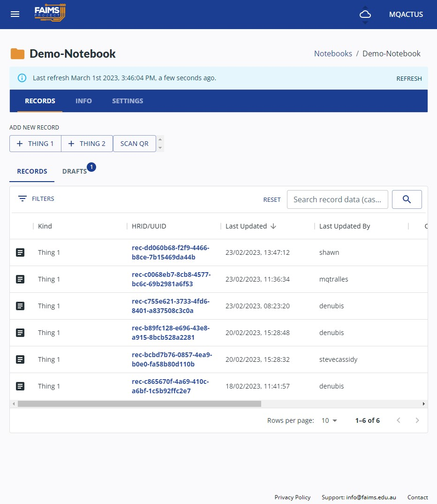
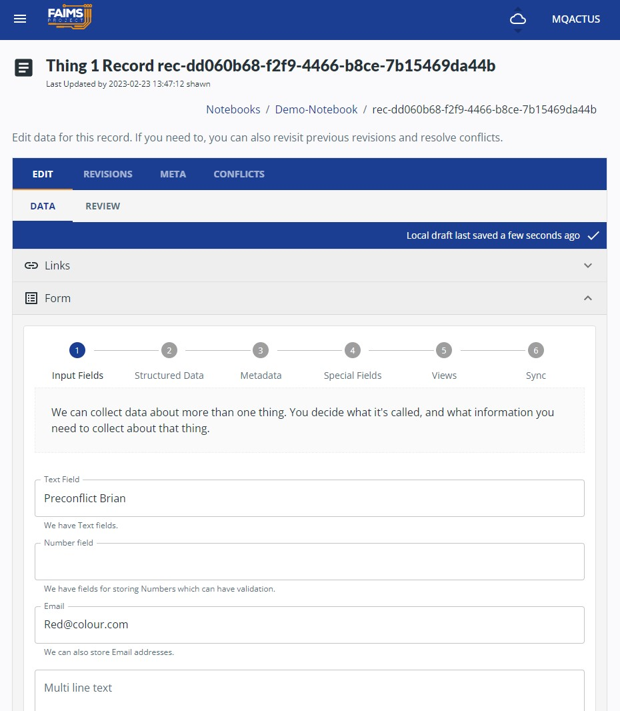

(intro/understanding-notebook)=
# Understanding the parts of a Notebook

A Fieldmark notebook is comprised of Forms which can be divided into Sections. Fields or Components are placed on each Section, in the order determined by the Notebook Creator.

## Forms
Forms are highest level of organisation with a Notebook and are best understood as an Entity in traditional data modelling. They should describe the subject (or one of the subjects) of your recording project and, on export, a .csv or spreadsheet will be created for each Form.

Within Fieldmark you will be able to add a Record for each Form you create in the App. In the Demo Notebook, Thing 1 and Thing 2 are Forms:       

## Sections
Sections are defined parts of a Form. They do not affect the output of data for that Form but allow the Notebook Creator to break up the different Fields and Components onto discreet views that allow researchers to capture data in the most efficient way.

In the Demo Notebook, there are six Sections within the Form for Thing 1 that appears as tabs across the top of the screen:

## Records
Records are the primary organising unit for observations made in Fieldmark. A record is created for each Form and together they will be exported into a single table or .csv. A record will include one or more Fields.

(intro/field-record-types)=
# Record and field types

Fieldmark offers a range of data formats and metadata, organised into different record types within a single notebook, to suit different data collection needs.  

Each Fieldmark data type is described below, followed by options for metadata,  helper text and other configuration settings available for all or most data types.

## Text fields

There are two primary input fields for text strings, numbers and email addresses:

1. The **Input Field** is a textfield which allows for a single line of free text with options to configure for text strings, numbers or email addresses:
	- *string* allows for any and all text, including special characters and emojis (tapping a string input field on your mobile device will call up the standard keyboard),
	- *number* will only accept numerals (tapping a number input field on your mobile device will call up the number pad), and
	- *email* will accept email addresses (tapping an email input field on your mobile device will call up a keyboard with the @ key near the spacebar).  
2. The **Input Box** is a textarea which allows for multiple lines of free text, including special characters and emojis.

## Date and Time fields

There are four types of Date and Time fields in Fieldmark:

1. **DateTimeNow**: automatically populates a date and time when the record is entered or when the button [Now]{.fieldmark-button} is pressed.
1. **Date Picker**: with a calendar prompt to select a date. May be set to today from a button inside the prompt.
2. **Date and Time Picker**: with a calendar prompt with a timestamp to select a date and time. May be set to the current date and time with a button inside the prompt.
3. **Month Picker**: with a calendar prompt to select just the month and year if that is all you need. May be set to the current month and year with a button inside the prompt.

:::{tip}
The date, datetime, and month pickers require advanced editing to implement in a form. See [Advanced Notebook Creation](advanced/notebook-creation-advanced)
:::

## Structured Data

There are five primary field types in Fieldmark that allow selection from a predetermined list:

1. The **Select Dropdown** field allows you to select one item from a list by tapping or clicking on the desired option from the dropdown menu 	
2. The **Multi Select Picker** allows you to select more than one option from the pick list by tapping or clicking the desired option from the picklist (choosing a selected item a second time will deselect unwanted selections)		
3. The **Hierarchical Picker** allows you to choose and option from an organised list. You can choose to store the full path, where that's useful, or just the end value if that is all you need. Fieldmark beta also has a still-in-development picture-dictionary where form elements can include pictures for ease of reference.
4. The **Checkbox** is a simple toggle and is useful if you have just one option (eg Yes/No, Left/Right), or if you want to implement a real-world checklist in your form.
5. The **Radio Button** allows you to choose from a list of options without a dropdown (this is useful if you only have a few choices).

:::{note}
According to the web standard, it is not possible to "unselect" a radio button. Imagine an old car radio. Once the button changes the channel, it cannot be "un-pushed."
:::

## Geospatial data
Fieldmark can capture geospatial data in two ways:

1. A single point
2. A point, line, or polygon drawn on a map

For more information, see [Mapping](intro/mapping).

## Attachments and Multimedia

Fieldmark supports two multimedia field types:

1. **Photos** which allow to capture images directly from your device's camera while using the App, or to attach already taken photos from your device's camera gallery.
2. **Attachments**: which allow you to add any file type to your record, eg a digital sketch captured on another app on (or shared with) the same device.

Pictures and attachments inherit the record's identifier upon export.

## Special Fields

### Basic Autoincrementer

Some research workflows need to assign a serial number to incoming records. Fieldmark supports a per-device autoincrementer. Each user, when setting up their device for the day or field season may assign one or more ranges of numbers at their own discretion. We recommend the field director or other supervisor allocate ranges (See the [Campus Survey Demo](demo/campus/set-ranges) for how to set the autoincrementer.)

:::{note}
The autoincrementer is useless on its own. If added to a form, it should participate in the form's Human-Readable Identifier
:::

### Human-Readable Identifiers

Fieldmark allocates a Universally Unique Identifier (UUID) to all records. These are long strings that are essential for the computational management of data, but can be confusing for humans. The UUID assigned by Fieldmark is unique, but hard to use.

For humans, instead, FAIMS has implemented a special field type, the 'Human-Readable Identifier.' This identifier does not have any guarentees of uniqueness or being not-null. However, it is composed of one or more fields  from within the form and optional unchanging text, and is displayed as the record's identifier in the project list and during export.

For example, one of our notebooks, CSIRO Geochemistry, has `[Campaign Area]-W-[Auto-Incrementer]` as its human readable identifier for a Water Sample. Campaign Area is a [persistent](<intro/fields/persistent>) input box. The auto incrementer is set at the beginning of the work day by the site supervisor, and the `-W-` indicates to readers that it is a water sample.

For more information about Identifiers and Incrementors see [Identifiers](advanced/identifiers).

### QR codes

Fieldmark, at this stage, has rudimentary QR code scanning capabilities when used by a mobile device. Inside a form, the [Scan QR Code]{.fieldmark-button} will launch the device's camera and look for scannable 1 or 2 dimensional codes understandable by the device. If a matching code is found, the field writes out the value of the code to a not-user-editable text field below the button.

If enabled, some notebooks may also prompt users to [Scan QR]{.fieldmark-button} on the notebook records page, alongside the new form buttons. This prompt, if it scans a valid code, will try to find a matching, previously saved code saved into an individual record as per above. If it does, it will load that record.

### Relationships
Fieldmark supports two kinds of relationships between forms:

1. Parent–Child Relationships
2. Linked Relationships

For more information see [relationships](intro/relationships).

## Per-Field Settings

Each field in the notebook designer can be configured in a number of different ways.

### Metadata
Fieldmark offers input options for annotation and certainty when the options are structured, but the data are fuzzy. These include a certainty flag and an option for annotated or marginal notes about the selected option.

#### Certainty Flags
All **Input** and **Structured Data** fields can be configured to include a checkbox for certainty. This allows the user to select a term from a picklist or enter a number and 'flag' the value as questionable or uncertain in some way. This is the digital equivalent of adding a question mark to a value on a paper form. The label for the flag can be customised, so the Notebook Designer could include a general flag for 'Not Sure', something more specialised like 'Label obscured' or a call to action such as 'Please Review'. Regardless of the label, the checkbox value will be stored as part of the metadata for that field, giving users the choice about how to present this uncertainty on export and during analysis.      

#### Annotations
All **Input** and **Structured Data** fields can be configured to include an annotation or marginal note. This is the digital equivalent of 'scribbling in the margin' on a paper form. It is useful when you need to make additional notes about a controlled vocabulary or number. The label for Annotation can be customised to allow for 'General Notes' or something more targeted like 'Recording Conditions'. Regardless of the label, the checkbox value will be stored as part of the metadata for that field, giving users the choice about how to present these marginal notes on export and during analysis.      

### Validation

In addition to the required of set field types (e.g. a *number* **Input field** must contain a number), all fields can be configured to enforce validation rules, as determined by the Notebook Creator:

1. Required or compulsory fields: the record cannot be saved if a value is not entered
2. Custom validation: such as a number must be between a certain range   

The custom json uses the [yup](https://github.com/jquense/yup) validation library.

:::{note}
At present, a failure for a form to validate will **block** saving the form. Our infrastructure does not, at present, support warnings.
:::

### Default data

**Fields** can be configured to include prepopulated text or other values. This may require editing the notebook's .json schema.

(intro/fields/persistent)=
### Persistent Values

**Fields** can be configured to include to be 'persistent'. Once changed, and the record is saved, if a new record is made, those values will 'persist' into the new record. If changed in the new record, their changed form will persist onwards. No historical records will be edited through this persistece mechanism.

### Inherited Values

**Fields** can be configured to display values in the Parent record to avoid duplicate entries in the child record.
