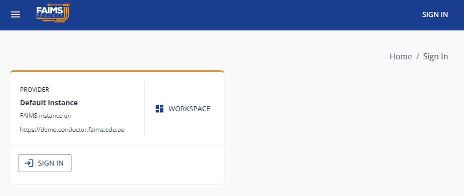
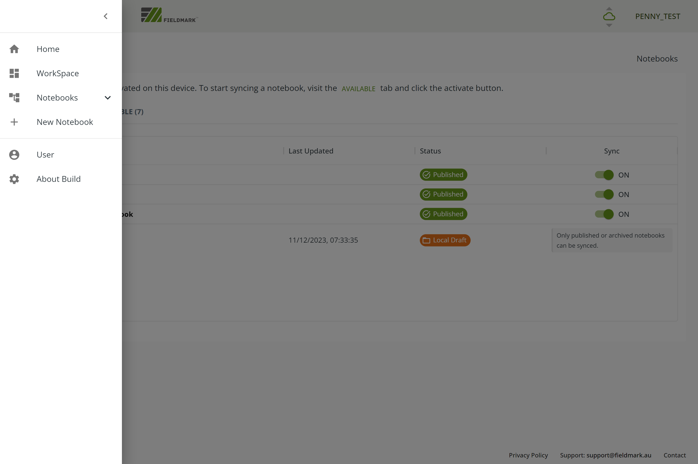

(intro/getting-started)=
# Getting Started

This guide is for new users working in a small team with an existing Notebook. If you are an Administrator setting up your Fieldmark™ environment for the first time, see [Getting Started as an Admin](advanced/getting-started-admin).  If you are using an Enterprise Notebook, speak to your organisation's Enterprise Administrator.

## New Users

### 1) Get your credentials sorted

Talk to the Administrator of the Notebook you are planning to use to discover their preferred method of authentication (see [Logging In](intro/logging-in)). You may need to create an account before they can give you permission to see the Notebook.

#### Looking for a trial account?

Sign up for a trial account at [here](https://forms.gle/ruaPVhDmEoyizHfr7).

### 2) Check your compatibility

For details of supported *operating systems* and recommendations for *hardware* see [Hardware](intro/hardware).

### 3) Download the App

While you still have an internet connection, download the Fieldmark™ App from the Android or iOS app stores:
- [Google Play](https://play.google.com/store/apps/details?id=au.edu.faims.fieldmark&hl=en&gl=US)
- [Apple App store](https://apps.apple.com/au/app/fieldmark/id1592632372)

Or open the Fieldmark™ App on a web browser on your desktop, or on a mobile device, at one of the following addresses:
- [Fieldmark™ Demonstration Server](https://fieldmark.app/)
- the server nominated by your organisation (see your Administrator for details)
- your organisation's server (for Enterprise users, see your Administrator for details)

You will see a Home page similar to this:

### 4) Login

To login, click the [ login &nbsp;Sign in]{.fieldmark-button} button on the main page or from the top right hand corner. You will see the main sign-in screen:

Click the [ login &nbsp;Sign in]{.fieldmark-button} button and select a Single Sign On (SS)) service, eg Google, or enter your local login credentials:

:::{image} /common-images/signinscreen.png
:alt: sign in service screen
:width: 50%
:align: center
:::

Check in with your Notebook Administrator if you're not sure which authentication service to use.

If your account is recognised, you will be successfully signed in and see your login name and role:

For more information on logging in, see [Logging In](intro/logging-in).   

### 5) Get to the know the Fieldmark™ Workspace

The Fieldmark™ Workspace is the base from where you can see and activate notebooks that have been shared with you, or draft notebooks that you have created yourself.

To access the Workspace click the [dashboard Workspace button]{.orange-button} on the Home page or select 'Workspace' from the Navigation Bar (accessed from the hamburger menu menu on the top left corner of the App):

On the main Workspace page you will see a list of activated and available notebooks:  

Published notebooks (that are shared with other uses and ready for synchronisation) are [green, showing 'Published']{.green-published}.

Draft notebooks that appear on your local device only are [orange, showing 'Local Draft']{.orange-local}. To publish a notebook, see [Notebook Creation](intermediate/notebook-creation).

If you cannot see a notebook as expected, contact the Notebook Administrator to ensure that the correct account has been authorised.    

To activate a notebook, click or tap [Activate]{.fieldmark-button} in the "Sync" column and wait for it to appear in the Activated list. You can then tap or click to start using the Notebook.

### 6) Try out a Demonstration Notebook

We have a number of demonstration notebooks available for all users to showcase the essential features of the Fieldmark™. The list will change over time and notebooks will be updated when new features are released. Records in all demonstration notebooks are wiped frequently, so don't use them to collect real data. To learn more about the current set of demonstration notebooks, read more at [Demonstration Notebooks](intro/demo-notebooks).

### 7) Still need help?

For [Troubleshooting](advanced/troubleshooting) for more information or contact us at support@fieldmark.au.

<link href="https://fonts.googleapis.com/icon?family=Material+Icons"
      rel="stylesheet">
