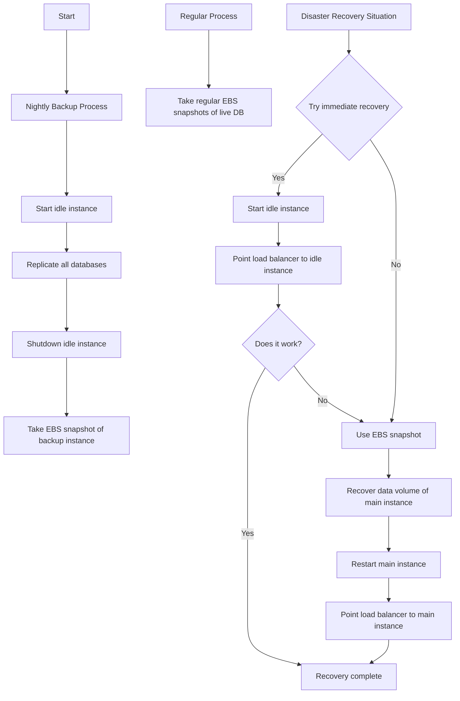

# FAIMS 3 CDK Deployment

This CDK project includes AWS infrastructure as code to deploy FAIMS 3 and its associated components.

## Architecture overview

### Networking

The `FaimsNetworking` construct sets up the core network infrastructure:

- **VPC**: A custom VPC with a maximum of 2 Availability Zones.
- **Subnets**: Public subnets only, with no NAT gateways.
- **Application Load Balancer (ALB)**: A shared, internet-facing ALB in the public subnets.
  - Supports both HTTP (port 80) and HTTPS (port 443) listeners.
  - Automatically redirects HTTP traffic to HTTPS.
  - Uses certificates from AWS Certificate Manager for HTTPS.

### CouchDB (Database)

The `EC2CouchDB` construct deploys CouchDB:

- **EC2 Instance**: Runs a single EC2 instance with CouchDB.
- **User Data**: Installs and configures CouchDB using Docker. Runs Docker command as systemd service. Mounts EBS for couch data and mounts into docker container.
- **Cloud Watch**: Includes a set of monitoring alarms triggering SNS topics, subscribed to an email address. Cloudwatch agent is installed and configured on instance. Logs collected and reported to /ec2/couchdb log stream.
- **Secrets Manager**: Stores CouchDB admin credentials.
- **Custom Configuration**: Sets up CouchDB with specific settings, including CORS and authentication handlers.
- **Load Balancer Integration**: Uses the shared ALB with a dedicated target group. Will support clustering in the future and performs TLS termination.
- **DNS**: Creates a custom domain for CouchDB access.

### Conductor (API Service)

The `FaimsConductor` construct sets up the API service:

- **ECS Fargate**: Runs the Conductor API as a containerized service.
- **Task Definition**: Configures the container with environment variables and secrets.
- **Load Balancer Integration**: Uses the shared ALB with a dedicated target group.
- **Auto Scaling**: Configures service auto-scaling based on request count.
- **Secrets**: Utilizes AWS Secrets Manager for sensitive data like cookie secrets and database credentials.
- **DNS**: Creates a custom domain for the Conductor API.

### Frontend

The `FaimsFrontEnd` construct manages the web applications:

#### Main FAIMS Frontend

- **S3 Bucket**: Hosts the static website files.
- **CloudFront Distribution**: Serves the website globally with HTTPS.
- **Custom Error Responses**: Configures 404 and 403 errors to return the index.html for SPA routing.
- **Build Process**: Uses a custom build script with environment variable injection.
- **Content Security Policy**: Configures CSP headers for connecting to CouchDB and Conductor.

#### Designer Frontend

- Similar setup to the main frontend, but with a separate S3 bucket and CloudFront distribution.
- Uses a different build process tailored for the designer application.

### Auxiliary Components

- **Lambda Function**: A Node.js function to deregister EC2 instances from CloudMap during termination.
- **EventBridge Rule**: Triggers the deregistration Lambda when an Auto Scaling group terminates an instance.

### Security and Access Management

- **Certificates**: Uses ACM certificates for HTTPS, with separate certs for CloudFront and ALB.
- **Secrets**: Stores and manages various secrets including database credentials, API keys, and JWT signing keys.

This infrastructure is defined using AWS CDK, allowing for easy replication and modification across different environments.

## Installation

With nvm

```
nvm install 20
nvm use 20
```

or if you have it installed already

```
npm i aws-cdk -g
npm i
```

Now follow the below steps to setup your configuration.

## Building artifacts

NPM is used to manage building some utility lambda functions separately to CDK process.

**Note**: These are intended to completely standalone from the monorepo in which this project lives.

To build the project

```
npm run build
```

To package for deployment.

```
npm run package
```

or just

```
npm run build && npm run package
```

This should build all the projects in `src`. If you add a new project, please update the `package.json` build scripts.

Use the existing packages as an example to start from, because the typescript config is very fussy.

## Configuration Setup

This project uses a JSON-based configuration system to manage different deployment settings. Here's how to set it up and use it:

### Creating Your Configuration

1. Navigate to the `configs/` directory in the project.
2. You'll find a file named `sample.json`. This is a template for your configuration.
3. Copy this file and rename it according to your environment (e.g., `dev.json`, `prod.json`).
4. Open your new configuration file and replace the placeholder values with your actual settings.

**For an example JSON structure, see `configs/sample.json`.**

Note: The values provided above are examples. Replace them with your actual values.

Here's a breakdown of each configuration value and its purpose:

- hostedZone - used for deploying Route 53 routes in AWS
  - id: The ID of your Route 53 hosted zone
  - name: The domain name of your hosted zone
- certificates
  - primary: ARN of your primary ACM certificate (must support *.base.domain)
  - cloudfront: ARN of your CloudFront ACM certificate (must be in us-east-1) (must support *.base.domain)
- aws
  - account: Your AWS account ID
  - region: The AWS region for deployment (e.g., ap-southeast-2 for Sydney) - defaults to ap-southeast-2
- secrets
  - privateKey: ARN of your private key in Secrets Manager
  - publicKey: ARN of your public key in Secrets Manager
- backup
  - vaultName: The name of the AWS Backup vault to create or use
  - retentionDays: The number of days to retain backups (default: 30)
  - scheduleExpression: The cron schedule for running backups (default: daily at 3 AM)
- couch
  - volumeSize: The size in GB of the EBS volume to mount to the EC2 instance
  - ebsRecoverySnapshotId: (Optional) The ID of an EBS snapshot to recover the couch data volume from
  - monitoring: (Optional) Configuration for CouchDB monitoring alarms
    - cpu: (Optional) CPU utilization alarm settings
      - threshold: Percentage threshold for CPU utilization (0-100)
      - evaluationPeriods: Number of periods to evaluate before triggering alarm
      - datapointsToAlarm: Number of datapoints that must be breaching to trigger alarm
    - memory: (Optional) Memory usage alarm settings (same structure as cpu)
    - disk: (Optional) Disk usage alarm settings (same structure as cpu)
    - statusCheck: (Optional) EC2 status check alarm settings
      - evaluationPeriods: Number of periods to evaluate before triggering alarm
      - datapointsToAlarm: Number of datapoints that must be breaching to trigger alarm
    - networkIn: (Optional) Network in alarm settings (same structure as cpu, but threshold in bytes)
    - networkOut: (Optional) Network out alarm settings (same structure as cpu, but threshold in bytes)
    - http5xx: (Optional) HTTP 5xx errors alarm settings (same structure as cpu, but threshold is count of errors)
    - alarmTopic: (Optional) SNS topic settings for alarms
      - emailAddress: Email address to send alarm notifications

NOTE: All monitoring settings are optional. If not provided, default values will be used. The alarmTopic emailAddress, if provided, will receive notifications for all configured alarms.

### Using Your Configuration

To use a specific configuration when deploying or synthesizing your CDK stack:

1. Open a terminal and navigate to your project directory.
2. Set the `CONFIG_FILE_NAME` environment variable to the name of your configuration file.
3. Run your CDK command.

For example, to deploy using a `production.json` configuration:

```bash
CONFIG_FILE_NAME=production.json cdk deploy
```

Or to synthesize using a `development.json` configuration:

```bash
CONFIG_FILE_NAME=development.json cdk synth
```

### Switching Between Configurations

You can easily switch between different configurations by changing the `CONFIG_FILE_NAME`:

- For development: `CONFIG_FILE_NAME=development.json`
- For production: `CONFIG_FILE_NAME=production.json`
- For any other environment: `CONFIG_FILE_NAME=your-config-file-name.json`

### Configuration File Location

All configuration files should be placed in the `configs/` directory of the project.

These are automatically git ignored.

### Generating Keys and Setting ARNs

This project includes a script to generate RSA key pairs and store them in AWS Secrets Manager. Follow these steps to generate keys and set the ARNs in your configuration:

1. Locate the script at `scripts/genKeysAWS.sh` in your project directory.

2. Run the script with the following command:

   ```bash
   ./scripts/genKeysAWS.sh <host_target> [profile_name] [--replace]
   ```

   - `<host_target>`: The name of the host (e.g., dev, prod).
   - `[profile_name]`: (Optional) The name of the profile to generate keys. Default is 'default'.
   - `[--replace]`: (Optional) Flag to replace existing secrets instead of aborting.

3. The script will generate RSA key pairs and store them in AWS Secrets Manager. It will output the ARNs for both the public and private key secrets.

4. Copy the ARNs provided in the script output.

5. Update your configuration file (e.g., `configs/development.json` or `configs/production.json`) with the new ARNs:

   ```json
   {
     ...
     "secrets": {
       "privateKey": "arn:aws:secretsmanager:region:account-id:secret:dev-keys-host-profile-private-xxxx",
       "publicKey": "arn:aws:secretsmanager:region:account-id:secret:dev-keys-host-profile-public-xxxx"
     }
   }
   ```

6. Replace the placeholder ARNs with the actual ARNs output by the script.

This process ensures that your CDK stack uses the correct, securely stored keys for JWT signing and validation.

Remember to run this script and update your configuration whenever you need to rotate keys or set up a new environment.

### CDK Context File (cdk.context.json)

**If you have an existing deployment**.

The `cdk.context.json` file is used by CDK to cache context values, which can include information about your AWS environment. This file is automatically generated and updated by CDK.

Important notes about `cdk.context.json`:

1. This file is gitignored to prevent committing potentially sensitive information.
2. If you have an existing deployment, you should include this file in your work environment.
3. Do not share this file publicly, as it may contain sensitive information about your AWS resources.

Managing `cdk.context.json`:

- For personal use: Keep the file locally and do not commit it to version control.
- For team use: Consider storing file in a private repository or a secure shared location.

To use an existing `cdk.context.json`:

1. Obtain the `cdk.context.json` file from your existing deployment or secure storage.
2. Place it in the root directory of this CDK project.
3. CDK will automatically use this file for context lookups.

If you need to refresh the context, you can delete the file and run `cdk synth` to regenerate it.

### Security Note

Your configuration files may contain sensitive information. Do not commit these files to version control. They are already added to `.gitignore` for your protection.

### Troubleshooting

- If you encounter an error about missing or invalid configuration, ensure that:
  1. Your configuration file exists in the `configs/` directory.
  2. The file name matches what you specified in `CONFIG_FILE_NAME`.
  3. The JSON in your configuration file is valid and contains all required fields.

By following these steps, you can easily manage different configurations for various deployment environments in this project.

## Deploying CDK app

Ensure you have sufficient permissions for the target account and that they are available to the CLI e.g. `aws sts get-caller-identity`.

Then follow the above steps to

- build the package artifacts `npm run build && npm run package`
- generate your keys i.e. `./scripts/genKeysAWS.sh <host_target> [profile_name] [--replace]`
- setup your config
  - download your config from private repo, put in `configs`, `export CONFIG_FILE_NAME=dev.json` for example
  - setup your `cdk.context.json` - put in this folder
- run appropriate cdk command
  - to synth only `cdk synth`
  - to diff `cdk diff`
  - to deploy or update `cdk deploy`

## Initialising DBs on first launch

The DBs are now initialised using a combination of

- EC2 user data on startup
- Conductor initialise route `/api/initialise`

The first is automatic, the second requires calling this endpoint, simply

```
curl -X POST https://your-conductor-endpoint.com/api/initialise
```

will suffice.

This

- establishes databases and configuration for them
- sets the public key for the database

This operation is a "no-op" if already setup.

## Recovering couch data volume from EBS Snapshot

The couch data volume is handled separately from the OS data in your instance. This allows the data volume to be backed up regularly without needing to be concerned about producing AMIs which associate the boot volume with EBS snapshots (such as in the AWS Backup for EC2 process). The config contains a flag to recover the EBS data volume from an existing EBS snapshot ID. The process to perform this recovery is explained below.

TODO: Verify and test these instructions with real data.

If you need to recover your CouchDB data from a previously created EBS snapshot, follow these steps:

1. **Locate your EBS snapshot ID**

   - Go to the AWS Management Console
   - Navigate to EC2 > Snapshots
   - Find the snapshot you want to use for recovery
   - Copy the Snapshot ID (it should look like `snap-0123456789abcdef0`)

2. **Update your configuration file**

   - Open your infrastructure configuration file (typically `configs/<stage>.json`)
   - Locate the `couch` section
   - Add or update the `ebsRecoverySnapshotId` field with your snapshot ID:

     ```json
     "couch": {
       ...
       "ebsRecoverySnapshotId": "snap-0123456789abcdef0"
     }
     ```

   - The `volumeSize` field will be ignored if a snapshot ID is provided

3. **Deploy your updated infrastructure**

   - Run your deployment command, for example:
     ```
     export CONFIG_FILE_NAME=<stage>.json
     cdk deploy
     ```

4. **Verify the recovery**

   - Once deployment is complete, SSM or SSH connect into your EC2 instance
     - TODO: verify a process to do this in production context - right now permissions would not allow this connection
   - Check that the CouchDB data volume is mounted correctly:
     ```
     df -h /opt/couchdb/data
     ```
   - Verify that CouchDB is running and can access the data:
     ```
     curl http://localhost:5984
     ```

5. **After Recovery**
   - It's probably safe to continue using
   - Once recovery is successful and you've verified your data, you may want to remove the `ebsRecoverySnapshotId` from your config to prevent accidental reuse in future deployments.
   - If you need to change the volume size or create a new volume:
     1. You'll need to manually delete the existing EBS volume through the AWS console or CLI.
     2. Remove the `ebsRecoverySnapshotId` from your config.
     3. Add the desired `volumeSize` to your config.
     4. Run `cdk deploy` to create a new volume with the specified size.

Remember:

- Always use CDK diff to understand the likely ramifications of your CDK update
- If you want to keep using the recovered data but need more space, consider using AWS EBS volume modification to increase the size of the existing volume instead of creating a new one.
- Deleting an EBS volume is irreversible. Always ensure you have backups before making such changes.

### Recovery process diagram (proposed)

The below diagram indicates three backup/recovery processes for couch

1. (CouchDB replication - left) Nightly startup of idle couch instance, replicate all databases from live DB, shut down. Run EBS snapshot.
2. (EBS Snapshots - middle) Nightly snapshots of live db data volume
3. (Recovery options - right)
   1. (Realtime rollover) Try recovering but starting up idle instance, adding to target group for load balancer, and removing unhealthy instance. This could be followed by getting the latest snapshot from the live instance and recovering it, depending on recovery priorities.
   2. (Recover backup DB from EBS snapshot) If prod continues to operate but data has been lost, could use idle database to recover from an EBS snapshot, and then replicate lost data.
   3. (Recover live DB from EBS snapshot) If both databases are not operational and require recovery, can directly recover the live DB from the latest EBS snapshot.


