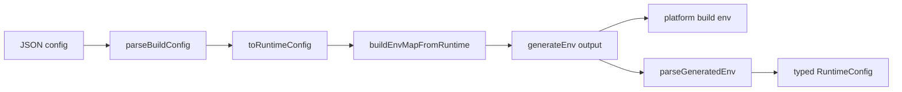

# @faims3/build-config

Central typed configuration module for FAIMS3 build-time and app runtime configuration.

This package is becoming the single source of truth for the config chain:

1. Source JSON configuration validation
2. Canonical typed runtime configuration object
3. Environment variable generation for platform/app builds
4. Environment parsing back into typed runtime config

## Goals

- One canonical schema for configuration meaning
- Strict validation (reject unknown keys and bad types)
- Shared semantic groups across app, web, and api
- Explicit environment contract for generated env keys
- Deterministic tests for config behavior

## Current Architecture

Core entry points:

- Canonical schemas and runtime model: [src/build-config.ts](src/build-config.ts)
- Env contract map: [src/env-contract.ts](src/env-contract.ts)
- Env generator CLI: [src/generate-build-config.ts](src/generate-build-config.ts)
- Coverage validation utility: [src/validate-generated-env.ts](src/validate-generated-env.ts)
- Tests: [test/generate-build-config.test.ts](test/generate-build-config.test.ts)

Data flow:

Key design idea:

- Configuration meaning is defined once in the canonical runtime model.
- Environment keys are transport, defined in an explicit mapping contract.
- Generators and parsers both route through the canonical model.

## Runtime Shape

The runtime config exported by this module is namespaced for semantic consistency:

- shared: cross-application semantics (urls, branding, maps, support, observability, deletion policy)
- app: mobile app specific behavior
- web: control centre specific behavior
- mobile: platform build metadata (android/ios)
- api: reserved server-target section (currently minimal in this package)

See definitions in [src/build-config.ts](src/build-config.ts).

## Strict Validation Rules

Validation is intentionally strict:

- Source JSON objects are strict and reject unknown keys.
- Environment parsing rejects invalid booleans, integers, and enums.
- Required values must be present or defaults must be declared.

This catches typo and drift early during CI/build.

## How To Add A New Configuration Option

Use this sequence every time.

1. Add meaning to canonical schema

- Add the field to the relevant schema section in [src/build-config.ts](src/build-config.ts).
- Prefer semantic grouping over app-specific naming.
- Decide required vs optional and default behavior.
- If the option is shared across targets, place it under shared semantics.

2. Add field to runtime model

- Extend RuntimeConfigSchema in [src/build-config.ts](src/build-config.ts).
- Update toRuntimeConfig mapping in [src/build-config.ts](src/build-config.ts) so JSON resolves into typed runtime value.

3. Add env transport mapping (if required)

- Add key mapping in [src/env-contract.ts](src/env-contract.ts).
- Map from runtime config to the generated environment key.
- Keep compatibility aliases only when needed; avoid duplicate semantic sources.

4. Add env parser support (if roundtrip parsing is needed)

- Add/extend GeneratedEnvSchema in [src/build-config.ts](src/build-config.ts).
- Update parseGeneratedEnv in [src/build-config.ts](src/build-config.ts) to map env value back to canonical model.

5. Add tests

- Add positive and negative tests in [test/generate-build-config.test.ts](test/generate-build-config.test.ts):
  - valid config produces expected env
  - invalid typed env is rejected
  - strict unknown-key rejection works
  - roundtrip behavior is preserved

6. Run checks

- Run package tests:
  - pnpm --filter=@faims3/build-config test
- Run coverage validator when changing generated keys:
  - pnpm --filter=@faims3/build-config run validate-coverage

## Using This Config In Different Apps

This package is intended to provide one typed source that each target consumes.

Current practical usage pattern:

1. Build pipeline / CI

- Generate env from JSON with [src/generate-build-config.ts](src/generate-build-config.ts).
- Feed generated env into platform/web build processes.

2. Runtime parsing

- Use parseGeneratedEnv in [src/build-config.ts](src/build-config.ts) for typed env-to-runtime parsing in module-level tests and tooling.
- App/web/api migration can progressively replace local duplicated parser logic with this package.

3. App-specific consumption

- App, web, and api should read their target-relevant sections from the namespaced runtime object.
- Shared behavior should always be read from shared namespace to avoid drift.

## Migration Guidance

When migrating an app to use this module directly:

1. Preserve existing env key compatibility first.
2. Replace local defaults with canonical defaults from this package.
3. Move app code to consume namespaced runtime sections.
4. Delete duplicated local schema logic only after parity tests pass.

Useful reference files in the main repo:

- App local parser today: [../../app/src/buildconfig.ts](../../app/src/buildconfig.ts)
- Web local parser today: [../../web/src/constants.ts](../../web/src/constants.ts)
- API local parser today: [../../api/src/buildconfig.ts](../../api/src/buildconfig.ts)

## Scripts

From this package:

- generate: emits env from config JSON
- validate-coverage: checks generated keys against app/web schema usage
- test: runs package tests

See [package.json](package.json).
