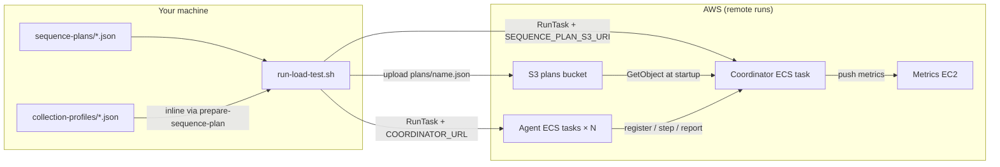

# FAIMS Load Testing Framework

Distributed browser-based load testing for the FAIMS3 collection app. A **coordinator** executes a JSON **sequence plan** and assigns steps to **agents** (Playwright workers). Metrics flow to Prometheus via Pushgateway.

> **Security disclaimer:** This framework is designed for **low-security, ephemeral** load tests only (disposable AWS tasks, short-lived coordinator/agents, test accounts in plain env vars). **Do not point it at production.** Ephemeral infra is not hardened for secret handling — credentials and tokens can leak via ECS task overrides, CloudWatch logs, S3 plan uploads, metrics EC2 config, or local `.env` files. Use dedicated staging/dev environments and throwaway test users only.

## Layout

| Path | Purpose |
|------|---------|
| [`coordinator/`](coordinator/) | Sequence plan engine, agent registry, metrics push |
| [`agents/`](agents/) | Playwright browser workers (poll coordinator for steps) |
| [`shared/`](shared/) | Zod schemas, HTTP API types, coordinator client, bundled plan/profile JSON |
| [`shared/sequence-plans/`](shared/sequence-plans/) | Example sequence plan JSON files |
| [`shared/collection-profiles/`](shared/collection-profiles/) | Record fill workflows referenced by collection phases |
| [`observability/`](observability/) | Prometheus, Grafana, Pushgateway configs |
| [`infra/`](infra/) | AWS CDK stack (ECS, metrics EC2, sequence-plans S3 bucket) |
| [`scripts/`](scripts/) | AWS runner, account seeding, status polling, cost/debug helpers |
| [`docker-compose.yml`](docker-compose.yml) | Local observability stack only |
| [`Makefile`](Makefile) | `observability`, `down`, `snapshot`, Docker image builds |

**Packages** (pnpm workspace): `@faims3/load-testing-shared`, coordinator, agents, and infra CDK. Coordinator and agents ship Dockerfiles; shared publishes Zod schemas, bundled plans/profiles, and the `prepare-sequence-plan` CLI.

## Architecture



**Plan delivery:** Only the **coordinator** loads the full plan JSON. Agents never read plan files — they call `GET /step?agentId=` and execute the returned step. This keeps agent configuration small and avoids duplicating large JSON across tasks.

**Remote runs (default):** `run-load-test.sh` inlines any `collectionProfile` filename references, then uploads the resolved plan to the stack’s S3 bucket (`plans/<filename>.json`) and passes `SEQUENCE_PLAN_S3_URI` to the coordinator. This avoids ECS’s 8192-byte per-environment-variable limit.

**Local runs:** Point the coordinator at a file with `SEQUENCE_PLAN_FILE=../shared/sequence-plans/….json`. The coordinator resolves profile filenames from `COLLECTION_PROFILES_DIR` (default `../shared/collection-profiles`) at startup.

## Prerequisites

- Docker and Docker Compose (for observability and CDK image builds)
- Node.js 22 and pnpm (for local development)
- FAIMS stack running (local or staging)
- `LOCAL_LOGIN_ENABLED` for automated login during onboarding
- Pre-seeded load-test users in CouchDB (see **Account pool** below)

For **AWS runs** (`run-load-test.sh`): AWS CLI v2, `jq`, and a deployed CDK stack. See [infra/README.md](infra/README.md).

## Quick start (local)

### 1. Observability stack

```bash
cd load-testing
cp .env.example .env
make observability
```

Grafana: http://localhost:3030 (anonymous admin enabled). Tear down with `make down`. After editing dashboards in the UI, run `make snapshot` to export JSON back into the repo.

### 2. Coordinator

```bash
cd load-testing/coordinator
cp .env.example .env
# Edit EXPECTED_AGENT_COUNT, LOAD_TEST_ACCOUNTS, SEQUENCE_PLAN_FILE
pnpm run dev
```

Or with Docker (from monorepo root):

```bash
make -C load-testing build-coordinator
docker run --env-file load-testing/coordinator/.env -p 4000:4000 \
  -e PROMETHEUS_PUSHGATEWAY_URL=http://host.docker.internal:9091 \
  --add-host=host.docker.internal:host-gateway \
  load-test-coordinator
```

### 3. Agents

```bash
cd load-testing/agents
cp .env.example .env
# Edit NOTEBOOK_PROJECT_ID, URLs, COORDINATOR_URL
pnpm run install-browsers   # first time only
pnpm run dev
```

Set `EXPECTED_AGENT_COUNT` on the coordinator to match how many agent processes you run.

Monitor progress:

```bash
COORDINATOR_URL=http://localhost:4000 ./scripts/poll-coordinator-status.sh
```

## Quick start (AWS)

Deploy infra once, then run tests from your laptop:

```bash
cd load-testing/infra && cp .env.example .env && pnpm run deploy
cd load-testing/scripts && cp .env.example .env
# Edit STACK_NAME, AWS_REGION, AGENT_COUNT, LOAD_TEST_ACCOUNTS, SEQUENCE_PLAN_FILE
./run-load-test.sh
```

The script uploads the plan to S3 and starts coordinator + agent ECS tasks. While a run is in progress, poll status with `COORDINATOR_URL=http://<coord-ip>:4000 ./poll-coordinator-status.sh`. Estimate Fargate cost first with `./estimate-run-cost.sh 15`.

See [infra/README.md](infra/README.md) and [scripts/.env.example](scripts/.env.example).

## Sequence plans

Set **one** plan source on the coordinator:

| Variable | When to use |
|----------|-------------|
| `SEQUENCE_PLAN_S3_URI` | AWS ECS runs (`s3://bucket/plans/name.json`) — **default for `run-load-test.sh`** |
| `SEQUENCE_PLAN_FILE` | Local dev — path to `.json` on disk |
| `SEQUENCE_PLAN` | Inline compact JSON (small plans) |
| `SEQUENCE_PLAN_B64` | Legacy ECS override (8192-byte limit) — set `SEQUENCE_PLAN_DELIVERY=env` in scripts |

Precedence: S3 URI → inline/base64 → file path.

Example plans: [`shared/sequence-plans/`](shared/sequence-plans/). See [shared/sequence-plans/README.md](shared/sequence-plans/README.md) for step types (`onboarding`, `online_collection`, `split`, `loop`, etc.).

## Collection profiles

Collection profiles describe **how** agents fill in records during `online_collection`, `offline_collection`, and `patchy_network` steps. Reference a profile by filename in plan JSON:

```json
"config": {
  "recordIntervalMs": 15000,
  "collectionProfile": "load-test-survey-site-minimal.json"
}
```

| Context | Profile resolution |
|---------|-------------------|
| Local coordinator | Resolves filenames from `COLLECTION_PROFILES_DIR` (default `../shared/collection-profiles`) or bundled profiles shipped with `@faims3/load-testing-shared` |
| AWS (`run-load-test.sh`) | Runs `prepare-sequence-plan` to inline profiles into the plan JSON before S3 upload |

See [shared/collection-profiles/README.md](shared/collection-profiles/README.md) for step actions (`fill`, `toggle`, `navigate_section`, …) and bundled examples. Quick smoke test: [`load-test-survey-smoke.json`](shared/sequence-plans/load-test-survey-smoke.json) against the `1780544113233-load-test-survey` notebook.

When `collectionProfile` is omitted, agents fall back to legacy behaviour (first `input`/`textarea` on the page).

## Configuration

| File | Variables |
|------|-----------|
| [`load-testing/.env.example`](.env.example) | CouchDB exporter + observability ports |
| [`coordinator/.env.example`](coordinator/.env.example) | Port, agent count, plan source, `COLLECTION_PROFILES_DIR`, pushgateway |
| [`agents/.env.example`](agents/.env.example) | FAIMS URLs, browser, notebook targets |
| [`scripts/.env.example`](scripts/.env.example) | AWS run: stack name, agents, plan file, accounts |
| [`infra/.env.example`](infra/.env.example) | CDK deploy: VPC, URLs, hosted zone |

### Account pool

1. Seed users (no migrations): `./scripts/seed-load-test-accounts.sh` — prints `LOAD_TEST_ACCOUNTS=email::password,...` (requires an already-initialised CouchDB and `api/.env`). Use `::` between email and password in `.env` — unquoted `||` breaks when bash sources the file.
2. Set that line on the **coordinator** (and `scripts/.env` for `run-load-test.sh`)
3. Each agent calls `GET /credentials?agentId=` once during onboarding; assignments are sticky per agent (round-robin across the pool)

Use **at most one agent per account** (`AGENT_COUNT` ≤ account count) to avoid concurrent edits on the same user.

## Scripts

All live under [`scripts/`](scripts/) (configure via `scripts/.env`):

| Script | Purpose |
|--------|---------|
| [`run-load-test.sh`](scripts/run-load-test.sh) | Upload plan to S3, start coordinator + agent ECS tasks, wait for completion |
| [`seed-load-test-accounts.sh`](scripts/seed-load-test-accounts.sh) | Create CouchDB users and print `LOAD_TEST_ACCOUNTS` |
| [`poll-coordinator-status.sh`](scripts/poll-coordinator-status.sh) | Live dashboard from `GET /status` (local or AWS coordinator IP) |
| [`estimate-run-cost.sh`](scripts/estimate-run-cost.sh) | Fargate cost estimate before a run |
| [`debug-metrics.sh`](scripts/debug-metrics.sh) | Diagnose empty Grafana panels after a run |
| [`tail-agent-logs.sh`](scripts/tail-agent-logs.sh) | Follow CloudWatch agent logs (AWS) |
| [`snapshot-grafana.sh`](scripts/snapshot-grafana.sh) | Export dashboard JSON (`make snapshot`) |
| [`generate-couchdb-exporter-env.sh`](scripts/generate-couchdb-exporter-env.sh) | Writes `couchdb-exporter.env` for local observability |
| [`wait-for-healthy.sh`](scripts/wait-for-healthy.sh) / [`wait-for-coordinator.sh`](scripts/wait-for-coordinator.sh) | Used by Makefile and `run-load-test.sh` |

## Limitations

- **Not for production** — see the security disclaimer above; ephemeral infra and plain-text test credentials are unsuitable for real user data or prod URLs
- Collection app (web/PWA) only — not native iOS/Android
- Requires local login or pre-seeded users on SSO-only environments
- `LOAD_TEST_ACCOUNTS` in ECS overrides can also approach the 8192-byte env limit at high agent counts — consider splitting accounts or a future S3/Secrets delivery path if needed

## Roadmap

Planned extensions to the load-testing framework and collection profiles:

| Item | Status | Notes |
|------|--------|-------|
| Photos and attachments in collection profiles | Planned | Collection profiles today skip photo/file fields (e.g. [`load-test-survey-site-minimal.json`](shared/collection-profiles/load-test-survey-site-minimal.json) uses `finish_anyway` to bypass required map/photo fields). **Main work is in the app**, not the agents: attachment fields (`TakePhoto`, `FileUploader`, etc.) go through Capacitor Camera / native file pickers and blob storage hooks that Playwright cannot drive reliably. We need app-side instrumentation — e.g. a load-test or web-only path that accepts programmatic file input (hidden `<input type="file">`, test hooks, or direct `addAttachment`/`attachmentEngine` entry points) — before agents can fill those steps in a profile. |
| App-side UX responsiveness metrics | Planned | Today most load-test timings are **agent-side** (Playwright wall clock for `record_create`, CDP Couch capture, onboarding `page_load`) or **sparse app-side** hooks via `@faims3/instrumentation` (`performance.measure` names prefixed `faims.*`, forwarded by the agent bridge). Expand instrumentation across the collection app so Grafana reflects real user-perceived latency, not just test harness timing. **Priority measures to wire:** record list load (first paint → interactive list), app cold/warm open (shell → notebook ready), photo/attachment upload (pick/blob → PouchDB stored → synced), section/tab navigation, record open (list tap → form interactive). **Also worth tracking:** save-to-sync round-trip (`RECORD_SAVE_SYNCED`), map render and record pins (`MAP_*` measures already defined), export download (`EXPORT_*`), sync reconnect and conflict UI, attachment thumbnail decode, search/filter response, long-form scroll jank (complement existing `longtask`), and background/foreground resume. Work spans adding `perf.mark`/`perf.wrap` at key UI boundaries, extending `FAIMS_MEASURES`, optional new `MetricReport` types or structured `detail` labels (form type, online/offline, record count bucket), and Grafana panels sliced by `stepId` and measure name. |

## See also

- [coordinator/README.md](coordinator/README.md) — HTTP API and plan loading
- [agents/README.md](agents/README.md) — Playwright scenarios and agent config
- [shared/sequence-plans/README.md](shared/sequence-plans/README.md) — plan step types and bundled examples
- [shared/collection-profiles/README.md](shared/collection-profiles/README.md) — profile actions and resolution
- [observability/README.md](observability/README.md) — metrics pipeline and Grafana
- [infra/README.md](infra/README.md) — CDK stack, AWS run lifecycle, CloudWatch logs
