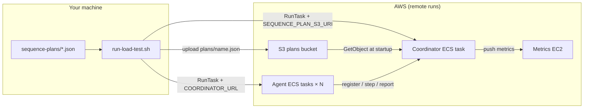

# DASS Load Testing Framework

Distributed browser-based load testing for the FAIMS3 collection app. A **coordinator** executes a JSON **sequence plan** and assigns steps to **agents** (Playwright workers). Metrics flow to Prometheus via Pushgateway.

## Layout

| Path | Purpose |
|------|---------|
| [`coordinator/`](coordinator/) | Sequence plan engine, agent registry, metrics push |
| [`agents/`](agents/) | Playwright browser workers (poll coordinator for steps) |
| [`shared/`](shared/) | Plan schemas, HTTP API types, coordinator client |
| [`shared/sequence-plans/`](shared/sequence-plans/) | Example plan JSON files |
| [`observability/`](observability/) | Prometheus, Grafana, Pushgateway configs |
| [`infra/`](infra/) | AWS CDK stack (ECS, metrics EC2, sequence-plans S3 bucket) |
| [`scripts/`](scripts/) | `run-load-test.sh`, account seeding, status polling |
| [`docker-compose.yml`](docker-compose.yml) | Local observability stack only |

Each package has its own `.env.example`, config parser (Zod), and `Dockerfile`.

## Architecture



**Plan delivery:** Only the **coordinator** loads the full plan JSON. Agents never read plan files — they call `GET /step?agentId=` and execute the returned step. This keeps agent configuration small and avoids duplicating large JSON across tasks.

**Remote runs (default):** `run-load-test.sh` uploads your local `SEQUENCE_PLAN_FILE` to the stack’s S3 bucket (`plans/<filename>.json`) and passes `SEQUENCE_PLAN_S3_URI` to the coordinator. This avoids ECS’s 8192-byte per-environment-variable limit.

**Local runs:** Point the coordinator at a file with `SEQUENCE_PLAN_FILE=../shared/sequence-plans/….json`.

## Prerequisites

- Docker and Docker Compose (for observability)
- Node.js 22 and pnpm (for local development)
- FAIMS stack running (local or staging)
- `LOCAL_LOGIN_ENABLED` for automated login during onboarding
- Pre-seeded load-test users in CouchDB (see **Account pool** below)

## Quick start (local)

### 1. Observability stack

```bash
cd load-testing
cp .env.example .env
make observability
```

Grafana: http://localhost:3030 (anonymous admin enabled).

### 2. Coordinator

```bash
cd load-testing/coordinator
cp .env.example .env
# Edit EXPECTED_AGENT_COUNT, LOAD_TEST_ACCOUNTS, SEQUENCE_PLAN_FILE
pnpm run dev
```

Or with Docker (from monorepo root):

```bash
make -C load-testing build-coordinator
docker run --env-file load-testing/coordinator/.env -p 4000:4000 \
  -e PROMETHEUS_PUSHGATEWAY_URL=http://host.docker.internal:9091 \
  --add-host=host.docker.internal:host-gateway \
  load-test-coordinator
```

### 3. Agents

```bash
cd load-testing/agents
cp .env.example .env
# Edit NOTEBOOK_PROJECT_ID, URLs, COORDINATOR_URL
pnpm run install-browsers   # first time only
pnpm run dev
```

Set `EXPECTED_AGENT_COUNT` on the coordinator to match how many agent processes you run.

## Quick start (AWS)

Deploy infra once, then run tests from your laptop:

```bash
cd load-testing/infra && cp .env.example .env && pnpm run deploy
cd load-testing/scripts && cp .env.example .env
# Edit STACK_NAME, AWS_REGION, AGENT_COUNT, LOAD_TEST_ACCOUNTS, SEQUENCE_PLAN_FILE
./run-load-test.sh
```

The script uploads the plan to S3 and starts coordinator + agent ECS tasks. See [infra/README.md](infra/README.md) and [scripts/.env.example](scripts/.env.example).

## Sequence plan sources (coordinator)

Set **one** of these on the coordinator:

| Variable | When to use |
|----------|-------------|
| `SEQUENCE_PLAN_S3_URI` | AWS ECS runs (`s3://bucket/plans/name.json`) — **default for `run-load-test.sh`** |
| `SEQUENCE_PLAN_FILE` | Local dev — path to `.json` on disk |
| `SEQUENCE_PLAN` | Inline compact JSON (small plans) |
| `SEQUENCE_PLAN_B64` | Legacy ECS override (8192-byte limit) — set `SEQUENCE_PLAN_DELIVERY=env` in scripts |

Precedence: S3 URI → inline/base64 → file path.

Example plans: [`shared/sequence-plans/`](shared/sequence-plans/). See [shared/sequence-plans/README.md](shared/sequence-plans/README.md) for step types (`onboarding`, `online_collection`, `split`, `loop`, etc.).

## Configuration

| File | Variables |
|------|-----------|
| [`load-testing/.env.example`](.env.example) | CouchDB exporter + observability ports |
| [`coordinator/.env.example`](coordinator/.env.example) | Port, agent count, plan source, pushgateway |
| [`agents/.env.example`](agents/.env.example) | FAIMS URLs, browser, notebook targets |
| [`scripts/.env.example`](scripts/.env.example) | AWS run: stack name, agents, plan file, accounts |
| [`infra/.env.example`](infra/.env.example) | CDK deploy: VPC, URLs, hosted zone |

### Account pool

1. Seed users (no migrations): `./scripts/seed-load-test-accounts.sh` — prints `LOAD_TEST_ACCOUNTS=email::password,...` (requires an already-initialised CouchDB). Use `::` between email and password in `.env` — unquoted `||` breaks when bash sources the file.
2. Set that line on the **coordinator** (and `scripts/.env` for `run-load-test.sh`)
3. Each agent calls `GET /credentials?agentId=` once during onboarding; assignments are sticky per agent (round-robin across the pool)

Use **at most one agent per account** (`AGENT_COUNT` ≤ account count) to avoid concurrent edits on the same user.

## Limitations

- Collection app (web/PWA) only — not native iOS/Android
- Requires local login or pre-seeded users on SSO-only environments
- `LOAD_TEST_ACCOUNTS` in ECS overrides can also approach the 8192-byte env limit at high agent counts — consider splitting accounts or a future S3/Secrets delivery path if needed

See also: [coordinator/README.md](coordinator/README.md), [agents/README.md](agents/README.md), [observability/README.md](observability/README.md), [infra/README.md](infra/README.md).
